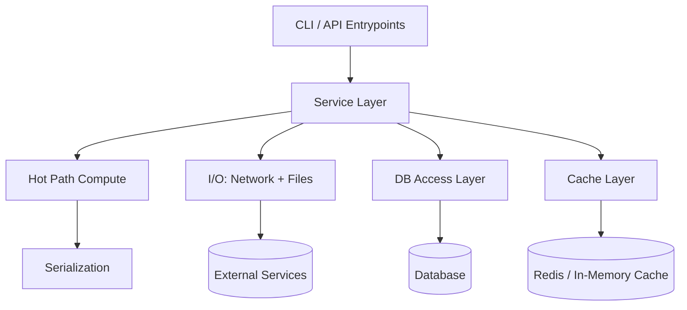
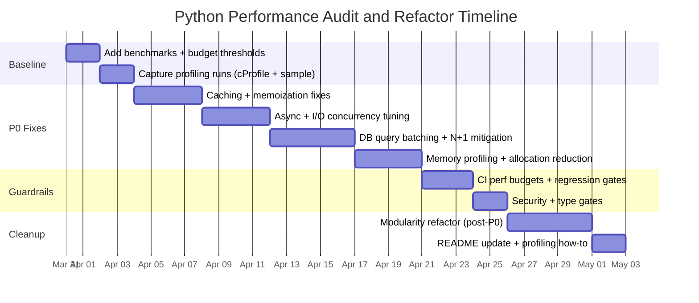

# Performance-First Audit Playbook for Python Projects

## Executive summary

This playbook is a **performance-first, audit-driven system** for improving any Python codebase while enforcing a strict hierarchy:

1) **Performance** (measured, profiled, regression-protected)
2) **Modularity / readability** (refactor without regressing performance)
3) **README / documentation** (only after behavior + performance stabilize)

The core idea: **you don’t refactor what you haven’t measured**, and you don’t document what you haven’t stabilized. The Python standard library profiling docs explicitly warn that profilers are designed for **execution profiling, not benchmarking** (use dedicated benchmarking tools like `timeit` for accuracy). citeturn9view0turn1search32

This report provides:

- A **prioritized checklist** (P0/P1/P2) with *rationale, detection, remediation (before/after), risk/impact, and tests* per item.
- A **file-level audit template** to record findings per source file.
- A repeatable **profiling workflow** covering deterministic and sampling profilers, CPU vs wall-clock time, async profiling, I/O/network bottlenecks, DB query analysis, memory profiling, and GC tuning. citeturn9view0turn0search1turn0search2turn1search1turn0search3turn2search3
- A **CI gating strategy** using correctness tests and performance budgets (e.g., `pytest-benchmark` regression thresholds, and/or `asv` for historical regression tracking). citeturn7search0turn7search4turn7search5turn7search1
- Sample code fixes for common high-impact issues: caching, allocation reduction, async improvements, and DB query batching.

## Measurement foundations and profiling toolkit

### Decide what “performance” means for your project

Before any change, define target metrics and thresholds. A practical set for most services and pipelines:

| Metric category | What to track                                   | Why it matters                        | Typical tool(s)                         |
| --------------- | ----------------------------------------------- | ------------------------------------- | --------------------------------------- |
| Latency         | p50 / p95 / p99 wall-clock time per request/job | Captures tail latency and variability | `pyperf` stats/percentiles; app metrics |
| Throughput      | req/s, jobs/min, rows/s                         | Verifies work capacity                | app metrics; benchmark harness          |
| CPU             | CPU time per request; % CPU                     | Distinguishes compute vs waiting      | `cProfile`, `py-spy`, `pyinstrument`    |
| Memory          | peak RSS; allocation hot spots                  | Prevents leaks and thrash             | `tracemalloc`, Heapy                    |
| DB              | query count, slow queries, plan costs           | N+1 and missing indexes dominate      | SQL logging, EXPLAIN                    |
| I/O/network     | time waiting on sockets/files; concurrency      | Often the real bottleneck             | async debug, traces                     |

For benchmark metrics and distribution analysis, **`pyperf` explicitly supports reliable benchmarking**, multiple processes, and statistical analysis (mean, standard deviation, percentiles, stability checks). citeturn7search6turn7search18

### Wall-clock time vs CPU time (and why you must separate them)

Python provides standardized timers that differentiate:

- `time.perf_counter()` is intended for **high-resolution wall-clock measurement** and **includes time elapsed during sleep**. citeturn12view0
- `time.process_time()` measures **CPU time** and **excludes time elapsed during sleep**. citeturn12view0
- `timeit` defaults to `perf_counter()`, but can be configured to measure process CPU time instead. citeturn1search32turn12view0

This separation is critical for diagnosing:

- CPU-bound work (optimize algorithms, vectorize, use multiprocessing)
- I/O-bound work (pooling, batching, async, concurrency limits)

### Deterministic vs sampling profilers (and when to use each)

**Deterministic profilers (instrument every call):**

- `cProfile` / `profile` produce exact call counts and timings and feed nicely into `pstats`. The standard library recommends `cProfile` for most users due to reasonable overhead vs pure-Python `profile`. citeturn9view0turn0search8
- Key caution: the Python docs explicitly note profilers are not for benchmarking (overhead differs across Python vs C-level code paths). citeturn9view0

**Sampling profilers (statistical):**

- **entity["organization","Pyinstrument","python profiler"]** samples the call stack at an interval (documented as ~every 1ms), providing low-overhead attribution. citeturn0search1turn0search17
- **entity["organization","py-spy","python profiler"]** is an external sampling profiler that can attach to a running process and record flamegraphs (`record`, `top`, `dump`). citeturn0search2turn0search38
- **entity["organization","Scalene","python profiler"]** positions itself as a high-performance CPU/memory profiler with low overhead and detailed attribution. citeturn1search3turn1search35

**Rule of thumb:**

- Use **cProfile** early when you can reproduce locally and need exact call relationships. citeturn9view0
- Use **Pyinstrument / py-spy / Scalene** when overhead must stay low, when profiling production-like loads, or when you need “what is hot right now” snapshots. citeturn0search1turn0search2turn1search3

### Async/await profiling and event-loop bottlenecks

Async performance failures often come from **coroutines that don’t yield**, hidden blocking I/O, or excessive task creation.

Primary built-in aids:

- **Asyncio debug mode** can be enabled via `PYTHONASYNCIODEBUG=1`, `asyncio.run(..., debug=True)`, or `loop.set_debug(True)`. citeturn1search1turn1search25turn3search5
- With debug mode, asyncio logs **slow callbacks** (default 100ms) and exposes `loop.slow_callback_duration` to adjust the threshold. citeturn1search1turn1search13turn1search37
- The asyncio dev docs explicitly warn: **CPU-bound code should not run directly in the event loop** because it delays all other tasks and I/O; use executors (`run_in_executor`) or processes for CPU-heavy work. citeturn3search5turn1search1
- For running work concurrently, `asyncio.create_task()` schedules coroutines as tasks. citeturn3search2turn5search9

If you need profiler-level visibility for async programs (especially “wall-time” across awaits), **entity["organization","Yappi","python profiler"]** documents support for asyncio-aware profiling. citeturn1search2turn1search10

### Memory profiling: allocation hot spots vs “what’s on the heap”

- `tracemalloc` traces Python memory allocations, supports snapshots, and can diff snapshots to help detect leaks or churn. citeturn0search3turn0search11
- It’s designed as a debug tool; start it early (environment variable / `-X tracemalloc` is described in the original PEP). citeturn0search11
- For heap inspection beyond allocation tracing, **entity["organization","Guppy3","python heap profiler"]** includes **Heapy**, described as a “heap analysis toolset” for inspecting heap objects and memory sizing. citeturn4search0turn4search3

### GC tuning and why it is a “last-mile” optimization

Python’s `gc` module allows:

- disabling/enabling cyclic GC,
- tuning collection frequency via thresholds. citeturn2search3turn2search11

Because GC changes can mask memory leaks and alter latency patterns, treat GC tuning as a **measured** optimization with rollback-ready controls and tests. citeturn2search3

## Performance-first checklist

Use this format during audits. **P0** items are “stop-the-line” gates: you should not proceed to broad refactors until these are addressed or explicitly accepted with measured impact.

### P0 — Establish a benchmark baseline and performance budgets

**Rationale.** The stdlib profiler docs warn profiling is not benchmarking; you need dedicated benchmarking to catch regressions reliably. citeturn9view0turn1search32

**Detect (commands).**

- Microbench/regression gate: `pytest --benchmark-only --benchmark-save=baseline` citeturn7search0turn7search4
- Compare and fail on regression: `pytest --benchmark-only --benchmark-compare --benchmark-compare-fail=mean:5%` citeturn7search0turn7search4
- For robust historical tracking: `asv quickstart`, `asv run`, `asv continuous`. citeturn7search5turn7search33turn7search1

**Remediate (before/after).**

Before (no budgets):

```python
def test_fast_enough():
    run_workload()
```

After (budgeted benchmark):

```python
def test_workload_speed(benchmark):
    result = benchmark(run_workload)
    assert result is None  # or validate output shape
```

**Risk/impact.** High impact, low-to-medium effort. Biggest payoff: stops performance regressions in PRs. citeturn7search8turn7search0

**Tests.**

- Unit correctness tests + benchmark tests in dedicated `tests/benchmarks/`.
- CI gates use `--benchmark-compare-fail` thresholds. citeturn7search4turn7search0

### P0 — Profile first: choose deterministic vs sampling, and separate CPU vs wall time

**Rationale.**

- `cProfile` is recommended for most users, and profilers output can be examined via `pstats`. citeturn9view0turn0search8
- Deterministic profiling monitors all call/return/exception events; statistical profiling samples instruction pointers and deduces time attribution. citeturn9view0turn0search1

**Detect (commands).**

- Deterministic: `python -m cProfile -o profile.pstats -s cumtime your_entrypoint.py` citeturn9view0
- Inspect: `python -c "import pstats; pstats.Stats('profile.pstats').sort_stats('cumtime').print_stats(30)"` citeturn0search8
- Sampling (stack attribution):
  - `pyinstrument your_script.py` citeturn0search17
  - `py-spy top --pid <PID>` or `py-spy record -o profile.svg --pid <PID>` citeturn0search2turn0search38

**Remediate (before/after).**

Before (guessing bottleneck):

```python
optimize_random_function()
```

After (profiling-driven):

```python
# Optimize only after cProfile/py-spy identifies hotspot X
```

**Risk/impact.** High impact; prevents “refactor roulette.” The risk is chasing profiler noise—mitigate by repeating runs and using sampling plus deterministic triangulation. citeturn9view0turn0search1

**Tests.**

- Add targeted benchmarks for identified hot paths.
- Keep acceptance tests for correctness while optimizing. citeturn7search8

### P0 — Eliminate repeated expensive computations using caching/memoization

**Rationale.**

- The standard library provides `functools.cache` (unbounded) and `lru_cache`; caching is explicitly positioned as memoization. citeturn2search0
- Third-party `cachetools` provides cache variants, including TTL-based caching. citeturn2search1turn2search9

**Detect (static patterns).**

- Repeated calls with same args in hot loops:
  - `for ...: expensive(x)` where `x` repeats frequently
  - repeated regex compilation, parsing, serialization inside loops (verify via profiler) citeturn9view0

**Detect (runtime).**

- `cProfile` shows high cumulative time in a pure function called frequently. citeturn9view0

**Remediate (before/after).**

Before:

```python
def compute_price(user_id: int) -> float:
    user = load_user(user_id)     # network/db
    rules = load_rules()          # repeated
    return apply_rules(user, rules)
```

After (`lru_cache` for stable inputs):

```python
from functools import lru_cache

@lru_cache(maxsize=1024)
def load_rules_cached() -> tuple:
    return tuple(load_rules())

def compute_price(user_id: int) -> float:
    user = load_user(user_id)
    rules = load_rules_cached()
    return apply_rules(user, rules)
```

If you need TTL:

```python
from cachetools import TTLCache, cached

_rules_cache = TTLCache(maxsize=256, ttl=60)

@cached(_rules_cache)
def load_rules_ttl() -> tuple:
    return tuple(load_rules())
```

citeturn2search0turn2search1

**Risk/impact.**

- Impact: often very high (cuts repeated work to O(unique inputs)).
- Risks: stale data, unbounded memory (especially `functools.cache`), and accidental object retention. A known pitfall: memoizing methods can keep instances alive if cache keys reference `self`. citeturn2search24turn2search0

**Tests.**

- Unit tests: caching correctness, invalidation/TTL behavior.
- Integration tests: verify eventual consistency and stale-data strategy.

### P0 — Fix I/O and network bottlenecks with pooling, batching, and concurrency limits

**Rationale.**

- Asyncio docs note that blocking/CPU-heavy work delays all tasks; use executors for blocking operations. citeturn3search5
- Asyncio debug mode logs slow callbacks and I/O selector delays, helping locate event-loop stalls. citeturn1search1

**Detect.**

- Wall-clock high, CPU time low (use `perf_counter` vs `process_time`). citeturn12view0
- Async debug logs show slow callbacks; raise signal by lowering `slow_callback_duration`. citeturn1search1turn1search37

**Remediate: async concurrency control (before/after).**

Before (unbounded concurrency; potential overload):

```python
results = await asyncio.gather(*(fetch(url) for url in urls))
```

After (bounded concurrency; avoids resource overload):

```python
import asyncio

sem = asyncio.Semaphore(50)

async def fetch_limited(url):
    async with sem:
        return await fetch(url)

results = await asyncio.gather(*(fetch_limited(u) for u in urls))
```

**Risk/impact.**

- Impact: high (prevents overload, reduces tail latency).
- Risk: too-low limits reduce throughput; tune with bench results, not intuition.

**Tests.**

- Integration test with a fake server that enforces rate limits or slow responses.
- Benchmark with varying concurrency caps; check p95/p99 improvements.

### P0 — Async profiling and “greedy coroutine” detection

**Rationale.**

- Asyncio debug mode exists specifically to ease development and logs slow callbacks; `loop.slow_callback_duration` controls the threshold. citeturn1search1turn1search37
- For concurrency, `asyncio.create_task()` is the standard mechanism to schedule tasks. citeturn3search2turn5search9

**Detect (commands).**

- Enable debug: `PYTHONASYNCIODEBUG=1 python your_app.py` citeturn1search1
- Or inside code: `asyncio.run(main(), debug=True)` citeturn1search1

**Remediate (before/after).**

Before (blocking CPU inside event loop):

```python
async def handler(req):
    data = expensive_cpu(req.payload)  # blocks loop
    return data
```

After (executor for blocking/CPU work; note asyncio dev guidance):

```python
import asyncio

async def handler(req):
    loop = asyncio.get_running_loop()
    data = await loop.run_in_executor(None, expensive_cpu, req.payload)
    return data
```

citeturn3search5turn1search1

**Risk/impact.**

- Big latency improvements for concurrent workloads.
- Risk: thread pool saturation; consider process pool for CPU-bound heavy work (and measure). citeturn3search3turn3search30

**Tests.**

- Integration test with concurrent requests to ensure responsiveness.
- Performance test: N concurrent handlers; verify p95 doesn’t explode.

### P0 — Database query analysis: detect N+1, batch writes, and validate plans

**Rationale.**

- SQLAlchemy docs describe the N+1 problem: lazy loading can cause **N+1 SELECT statements**, and eager loading is the common mitigation. citeturn8search0
- SQL logging (`echo=True` on engine) can reveal query time and patterns. citeturn8search1turn8search23
- PostgreSQL docs clarify `EXPLAIN ANALYZE` shows planning vs execution time, and `ANALYZE` executes the statement to show actual runtime per plan node. citeturn8search2turn8search6
- For `sqlite3`, `executemany` is documented and `arraysize` is called out as a performance consideration for fetching. citeturn8search3

**Detect.**

- SQLAlchemy: enable SQL logging and count queries per request (watch for N+1 patterns). citeturn8search1turn8search23
- PostgreSQL: run `EXPLAIN (ANALYZE, BUFFERS)` (DB-specific), compare plan/exec time. citeturn8search6turn8search2
- SQLite: detect per-row inserts, replace with `executemany`. citeturn8search3

**Remediate: DB batching (before/after).**

Before (per-row insert):

```python
for row in rows:
    cur.execute("INSERT INTO data VALUES (?)", row)
```

After (`executemany` batching):

```python
cur.executemany("INSERT INTO data VALUES(?)", rows)
```

citeturn8search3

**Remediate: ORM eager loading (SQLAlchemy example).**

Before (lazy load triggers N+1):

```python
parents = session.query(Parent).all()
for p in parents:
    do_something(p.children)  # triggers extra SELECTs
```

After (eager loading strategy):

```python
from sqlalchemy.orm import selectinload

parents = (
    session.query(Parent)
    .options(selectinload(Parent.children))
    .all()
)
for p in parents:
    do_something(p.children)
```

SQLAlchemy’s own docs explain N+1 and eager loading as mitigation. citeturn8search0

**Risk/impact.**

- Very high impact in DB-heavy apps.
- Risk: eager loading can increase loaded data volume; verify memory and response size.

**Tests.**

- Integration tests assert max query count for a request (query-count harness).
- Benchmarks for “list page” endpoints where N+1 tends to appear.

### P0 — Memory profiling and allocation reduction using tracemalloc and Heapy

**Rationale.**

- `tracemalloc` traces allocations, provides per-file/per-line statistics, and snapshot diffing to detect leaks. citeturn0search3turn0search11
- Heapy is positioned as a heap analysis toolset to inspect objects on the heap. citeturn4search0turn4search3

**Detect (commands).**

- Start tracemalloc early (`-X tracemalloc` or environment variable described in the PEP). citeturn0search11
- Snapshot diffing workflow (conceptual; implement in your harness):
  1) snapshot at start
  2) run workload N times
  3) snapshot again
  4) compare top differences by file/line citeturn0search3

**Remediate: reduce allocations (example).**

Before (repeated new objects, repeated parsing/serialization):

```python
def handle(items):
    out = []
    for s in items:
        obj = json.loads(s)      # repeated allocations
        out.append(obj["id"])
    return out
```

After (streaming + reuse + cached parsing strategy depends on use-case; at minimum, benchmark-driven):

```python
def handle(items):
    out_append = [].append  # micro-opt only if proven hot
    out = []
    for s in items:
        obj = json.loads(s)
        out.append(obj["id"])
    return out
```

If `json` decoding becomes a DoS vector, the stdlib docs explicitly warn that malicious JSON can consume considerable CPU and memory; apply size limits and parsing safeguards. citeturn4search1

**Risk/impact.**

- Impact ranges from moderate to massive (especially for hot loops).
- Risk: micro-optimizations can harm readability; only keep changes justified by profiling. citeturn9view0

**Tests.**

- Regression tests for memory growth: run workload N times and assert bounded memory deltas (best effort in CI; strongest on dedicated runners).
- Unit tests verifying behavior unchanged.

### P0 — GC tuning (only after proving GC is a culprit)

**Rationale.**

- The `gc` module supports disabling GC and tuning thresholds (collection frequency). citeturn2search3turn2search11

**Detect.**

- Profilers show significant time inside GC or periodic latency spikes aligned with collections (confirm via measured traces and repeatability).
- Allocation hot spots identified by `tracemalloc` suggest GC pressure. citeturn0search3turn2search3

**Remediate (before/after).**

Before (GC interrupts a tight loop unpredictably):

```python
def tight_loop(data):
    for x in data:
        process(x)
```

After (only if cycles are absent / controlled; measured and reversible):

```python
import gc

def tight_loop(data):
    gc_was_enabled = gc.isenabled()
    gc.disable()
    try:
        for x in data:
            process(x)
    finally:
        if gc_was_enabled:
            gc.enable()
```

GC disabling is explicitly supported but is only safe if you’re confident you aren’t creating reference cycles. citeturn2search3

**Risk/impact.**

- Potentially high impact for low-latency workloads.
- High risk: memory growth if cycles exist; always couple with memory tests.

**Tests.**

- Stress tests that create cyclic references intentionally to validate safeguards (or detect unacceptable growth).
- Memory regression harness with `tracemalloc` snapshot diffing.

### P0 — Concurrency choices: threading vs multiprocessing vs asyncio (and the GIL)

**Rationale.**

- The `threading` docs explicitly note the GIL limits threading gains for CPU-bound tasks (only one thread executes Python bytecode at a time), but threads are useful for concurrency. citeturn3search0
- `multiprocessing` uses separate processes; `concurrent.futures` provides ThreadPoolExecutor and ProcessPoolExecutor under a consistent interface. citeturn3search30turn3search3
- Python’s concurrency overview emphasizes choosing tools based on CPU-bound vs I/O-bound workload characteristics. citeturn3search17

**Detect.**

- If CPU is saturated and tasks don’t speed up with threads, GIL-limited CPU-bound work is likely.
- If wall time is high but CPU is low, it’s probably I/O-bound; threads/async can help. citeturn12view0turn3search0

**Remediate (before/after).**

Before (CPU-bound work in threads; limited scaling):

```python
with ThreadPoolExecutor() as ex:
    results = list(ex.map(cpu_heavy, items))
```

After (process pool for CPU-bound):

```python
from concurrent.futures import ProcessPoolExecutor

with ProcessPoolExecutor() as ex:
    results = list(ex.map(cpu_heavy, items))
```

Thread vs process executors are documented in `concurrent.futures`. citeturn3search3turn3search30

**Risk/impact.**

- High impact for CPU-heavy pipelines.
- Risk: serialization overhead, increased memory, startup cost, and IPC complexity.

**Tests.**

- Integration test that runs parallel path and verifies determinism/order-invariance.
- Benchmark that includes serialization cost to/from workers.

### P0 — Vectorization with NumPy, and what not to do

**Rationale.**

- NumPy broadcasting explicitly enables vectorization so looping occurs in **C instead of Python**, avoids needless copies, and is usually efficient. citeturn5search1
- `numpy.vectorize` is explicitly “primarily for convenience, not for performance” and is essentially a loop. citeturn5search33

**Detect.**

- Hot loops doing element-by-element numeric operations in Python (confirmed via profiler).
- `numpy.vectorize(...)` present in hot path (often a performance smell). citeturn5search33

**Remediate (before/after).**

Before (pure Python loop):

```python
out = []
for x in arr:
    out.append(x * x + 3)
```

After (vectorized NumPy):

```python
out = arr * arr + 3
```

**Risk/impact.**

- Often huge speedup; typically improved code clarity.
- Risk: memory blowups if you create many temporary arrays; validate memory.

**Tests.**

- Unit tests for numeric equivalence (including dtype/shape edge cases).
- Benchmark tests before/after to quantify improvement.

### P0 — Serialization costs and safety constraints

**Rationale.**

- The `json` module warns untrusted JSON can cause high CPU and memory usage; apply size limits and defensive parsing. citeturn4search1
- The `pickle` module implements serialization protocols but is not secure against malicious data—never unpickle untrusted input. citeturn4search2turn4search8

**Detect.**

- Profilers show heavy time under `json.loads/dumps` or `pickle.loads/dumps`.
- Large payload sizes or repeated serialization within tight loops.

**Remediate (before/after).**

Before (unbounded decode on untrusted input):

```python
payload = json.loads(user_supplied_string)
```

After (basic guardrails; customize per app):

```python
if len(user_supplied_string) > MAX_JSON_BYTES:
    raise ValueError("payload too large")
payload = json.loads(user_supplied_string)
```

**Risk/impact.**

- Security and reliability impact is high.
- Perf impact depends on workload; usually meaningful for heavy serialization workloads.

**Tests.**

- Fuzz/negative tests for oversized payloads.
- Benchmarks on typical payload sizes.

## Modularity and readability checklist

These items are second in priority; implement after P0 performance gates are stable.

### P1 — Refactor along “hot path” boundaries, not arbitrary layers

**Rationale.** Structuring modules so hot paths are isolated reduces the risk of accidental regression and makes profiling results actionable (you can benchmark a narrow unit). This aligns with the profilers’ focus on function-level statistics and call relationships. citeturn9view0turn0search8

**Detect.**

- Profiling shows 80% of time in a small set of functions, but code is spread across mixed-responsibility modules.
- Large functions doing parsing + DB + business logic + serialization together.

**Remediate.**

- Split into:
  - `hotpath/` (pure compute, minimal dependencies)
  - `io/` (network, filesystem)
  - `db/` (query building, batching)
  - `api/` or `cli/` (entrypoints)

**Risk/impact.**

- Medium effort; large maintainability gain.
- Risk: over-abstraction; keep boundaries pragmatic and benchmarkable.

**Tests.**

- Unit tests for pure “hotpath” functions (fast and deterministic).
- Integration tests for wiring.

### P1 — Avoid global mutable state, especially for caches and concurrency primitives

**Rationale.** Global mutable caches and executors often create:

- hidden coupling,
- test flakiness,
- cross-request memory growth,
- lifecycle problems (shutdown, invalidation).

Caching risks are well-known; memoization can even cause unexpected object retention (e.g., caching bound methods). citeturn2search24turn2search0

**Detect.**

- Module-level dict caches with no bounds/TTL.
- Global executors never shut down.
- Global sessions/clients without lifecycle control.

**Remediate.**

- Encapsulate caches behind a small interface with explicit TTL/size and explicit invalidation.
- Use dependency injection (pass cache/client/executor into functions or classes).

**Risk/impact.**

- Improves correctness and testability; performance neutral to positive.

**Tests.**

- Unit tests for cache invalidation and bounded size.
- Integration tests that spin up and tear down components cleanly.

### P1 — Static analysis and typing gates that support safe performance work

**Why these tools matter (in this hierarchy).**

- Performance work often alters code shape; strong static analysis reduces refactor risk.

Recommended baseline and primary references:

- **entity["organization","Flake8","python linter"]** configuration is supported via `setup.cfg`, `tox.ini`, or `.flake8` (important for standardizing lint enforcement). citeturn6search8
- **entity["organization","Pylint","python linter"]** supports fine-grained enable/disable at line/scope/module and is documented in its message control system. citeturn6search1turn6search9
- **entity["organization","mypy","python type checker"]** is a static type checker; type hints are checked without running code. citeturn6search2turn6search6
- **entity["organization","Bandit","python security linter"]** scans AST and reports common security issues; it’s designed for security risk detection. citeturn6search3turn6search20

Optional modernization note: flake8 does not natively center on `pyproject.toml` in its official docs, while tools like **entity["organization","Ruff","python linter"]** explicitly support configuring ignores in `pyproject.toml`. citeturn6search8turn6search17

## CI gates, automated tests, and sample CI YAML

### CI gate model (performance-first)

| Gate                |        Must pass? | What it blocks              | Tooling                                                          |
| ------------------- | ----------------: | --------------------------- | ---------------------------------------------------------------- |
| Unit tests          |               yes | correctness regressions     | `pytest` citeturn7search7                                     |
| Integration tests   |               yes | real I/O regressions        | `pytest` markers citeturn7search3turn7search11               |
| Static checks       |               yes | maintainability regressions | flake8/pylint/mypy citeturn6search8turn6search9turn6search2 |
| Security checks     | yes (recommended) | unsafe patterns             | bandit citeturn6search3                                       |
| Performance budgets | yes for hot paths | perf regressions            | pytest-benchmark / asv citeturn7search0turn7search5          |
| Artifact upload     |               yes | auditability                | JSON reports, flamegraphs                                        |

### Benchmark gating tools and when to use each

- `pytest-benchmark`: best for **PR-level regression checks**; supports saving runs and failing on regressions via `--benchmark-compare-fail`. citeturn7search0turn7search4
- `asv`: best for **historical regression analysis** across many commits; docs note regression detection is designed to be statistically robust and tolerates noise (important for CI). citeturn7search1turn7search5
- `pyperf` / `pyperformance`: best for **reproducible benchmarking methodology** and stable statistics; designed to avoid unnatural “special modes” that don’t reflect real running conditions. citeturn7search6turn7search18turn7search2

### Sample GitHub Actions workflow snippet

```yaml
name: ci

on:
  pull_request:
  push:
    branches: [ main ]

jobs:
  test-lint-bench:
    runs-on: ubuntu-latest
    strategy:
      matrix:
        python-version: ["3.12", "3.13"]

    steps:
      - uses: actions/checkout@v4

      - name: Set up Python
        uses: actions/setup-python@v5
        with:
          python-version: ${{ matrix.python-version }}

      - name: Install deps
        run: |
          python -m pip install --upgrade pip
          pip install -r requirements-dev.txt

      - name: Lint (flake8)
        run: flake8 .

      - name: Lint (pylint)
        run: pylint your_package tests

      - name: Type check (mypy)
        run: mypy your_package

      - name: Security (bandit)
        run: bandit -r your_package -q

      - name: Unit tests
        run: pytest -q

      - name: Benchmarks (compare + fail on regression)
        run: |
          pytest tests/benchmarks \
            --benchmark-only \
            --benchmark-save=pr \
            --benchmark-compare \
            --benchmark-compare-fail=mean:5%
```

Notes:

- The benchmark gating flags shown above are directly supported by `pytest-benchmark`. citeturn7search0turn7search4
- If CI noise causes false positives, shift PR gating to “warn + upload artifacts” and rely on `asv`’s regression model on stable runners. citeturn7search1turn7search5

## File-level audit templates

### File-level audit table

Use this table to record findings **per source file**, enforced by the hierarchy.

| File             | Role | Hot path? (Y/N) | Current metric baseline | Profiling evidence (which profiler, top frames) | Bottleneck type (CPU/I/O/DB/mem/serialization) | Findings | Priority (P0/P1/P2) | Effort (XS–XL) | Proposed change | Risks | Tests to add | Status |
| ---------------- | ---- | --------------: | ----------------------- | ----------------------------------------------- | ---------------------------------------------- | -------- | ------------------- | -------------- | --------------- | ----- | ------------ | ------ |
| `src/foo.py`     |      |                 |                         |                                                 |                                                |          |                     |                |                 |       |              |        |
| `src/db/bar.py`  |      |                 |                         |                                                 |                                                |          |                     |                |                 |       |              |        |
| `src/api/baz.py` |      |                 |                         |                                                 |                                                |          |                     |                |                 |       |              |        |

### Profiling session log template

Use one log entry per profiling run.

| Date       | Commit | Workload scenario  | Mode (prod-like?) | Profiler | Command                  | Key hot spots    | Notes            | Follow-up benchmark ID |
| ---------- | ------ | ------------------ | ----------------- | -------- | ------------------------ | ---------------- | ---------------- | ---------------------- |
| 2026-03-29 | abc123 | “/export 10k rows” | yes               | cProfile | `python -m cProfile ...` | `foo()`, `bar()` | DB N+1 suspected | `0004_pr.json`         |

This is aligned with stdlib profiling outputs and the `pstats` workflow for deterministic profilers. citeturn9view0turn0search8

## Refactor workflow, diagrams, timeline, and README template

### Step-by-step refactor workflow (with effort estimates)

Effort scale:

- **XS**: < 0.5 day
- **S**: 0.5–1 day
- **M**: 1–3 days
- **L**: 3–5 days
- **XL**: 1–2+ weeks

Workflow:

1) **Baseline + budgets (S)**
   Add benchmark harness (`pytest-benchmark` or `pyperf`) and record a baseline run ID. citeturn7search8turn7search0turn7search6

2) **Profiler triangulation (S–M)**
   Run `cProfile` for call relationships and at least one sampling profiler for low-overhead hotspot confirmation. citeturn9view0turn0search1turn0search2

3) **Fix top P0 bottleneck (M–L)**
   Make the smallest change consistent with the measurement—caching, batching, or concurrency adjustment. Re-run benchmarks and confirm improvement.

4) **Guardrail tests + CI gating (S–M)**
   Add regression benchmark + correctness tests; configure `--benchmark-compare-fail` threshold. citeturn7search4turn7search0

5) **Repeat P0 until budgets met (M–XL)**
   Iterate: hotspot → fix → measure → lock-in test.

6) **Modularity refactors (M–L)**
   Only now split modules, remove global state, strengthen types. Use `mypy` and lint to reduce refactor risk. citeturn6search2turn6search9

7) **Documentation update (S)**
   Update README after APIs and performance budgets stabilize.

### Mermaid diagrams

Component relationships (generic Python system map; customize to your repo):



Gantt-style refactor timeline (sample; adjust):



### README update template (performance-first documentation)

```md
## Performance Playbook

This repository follows a strict improvement hierarchy:
1) Performance
2) Modularity/readability
3) Documentation

### Performance targets
- Define budgets for key workloads (p95/p99 latency, throughput, memory).
- Benchmarks are versioned and compared in CI.

### How to run profiling
#### Deterministic (exact call counts)
- `python -m cProfile -o profile.pstats -s cumtime your_entrypoint.py`
- Inspect:
  - `python -c "import pstats; pstats.Stats('profile.pstats').sort_stats('cumtime').print_stats(40)"`

#### Sampling (low overhead)
- `pyinstrument your_entrypoint.py`
- `py-spy top --pid <PID>`
- `py-spy record -o profile.svg --pid <PID>`

### Async debugging
- Enable asyncio debug:
  - `PYTHONASYNCIODEBUG=1 python your_app.py`
  - or `asyncio.run(main(), debug=True)`
- Tune slow callback threshold using `loop.slow_callback_duration`.

### Benchmarks and regression gates
- Run benchmarks:
  - `pytest tests/benchmarks --benchmark-only --benchmark-save=baseline`
- Compare and fail on regression:
  - `pytest tests/benchmarks --benchmark-only --benchmark-compare --benchmark-compare-fail=mean:5%`

### Caching conventions
- Use `functools.lru_cache` or `cachetools` for bounded/TTL caching.
- Avoid memoizing instance methods unless you are sure it will not retain instances.

### Database performance
- Enable SQL logging to detect N+1.
- Use EXPLAIN ANALYZE for PostgreSQL query plan validation.
- Batch writes using `executemany` where applicable.

### Memory profiling
- Use `tracemalloc` snapshots to find allocation hot spots.
- Use Heapy for heap inspection when needed.
```

This README structure explicitly documents the same “ground truth” workflow the primary sources describe: deterministic profiling via `cProfile` and `pstats`, benchmarking via dedicated tools (`timeit`/benchmark frameworks), asyncio debug tooling, and safe caching and DB practices. citeturn9view0turn0search8turn1search1turn7search0turn2search0turn8search3turn8search2turn0search3
