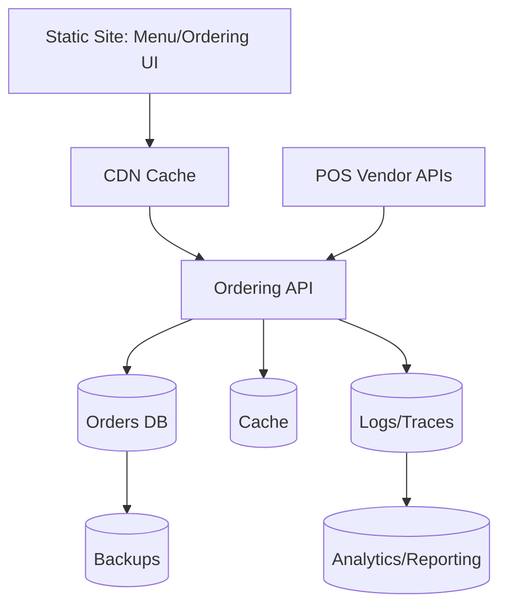
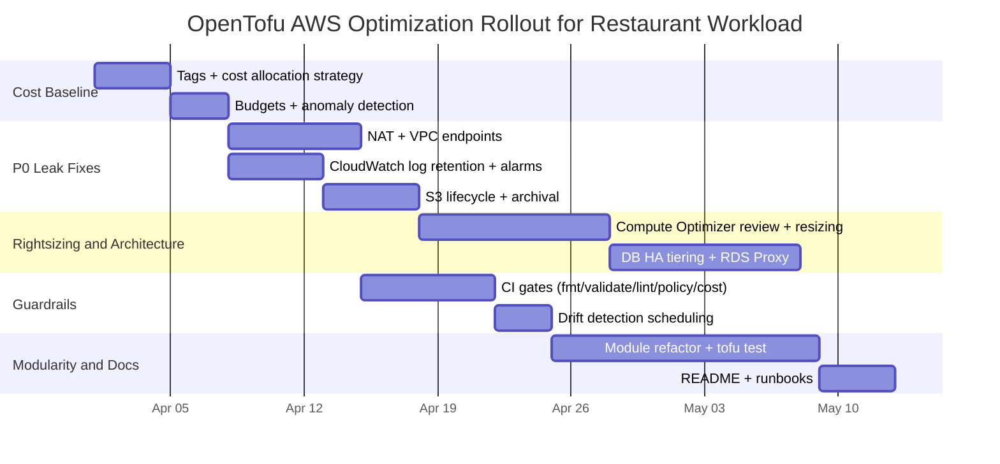

# OpenTofu AWS Infrastructure Audit Playbook for a Restaurant Project

## Executive summary

This playbook is a **performance- and cost-first audit system** for designing and operating infrastructure using OpenTofu (Terraform-compatible). It enforces a strict hierarchy:

- **Cost & performance optimization** first (prevent billing surprises, stop waste, reduce latency, and constrain egress).
- **Modularity / readability of IaC** second (reusable modules, safe state patterns, predictable environments).
- **README / documentation** last (only after the implementation and guardrails are stable).

The approach aligns with the: the Cost Optimization pillar focuses on achieving business outcomes at the lowest price point, and the Performance Efficiency pillar focuses on efficient resource use as demand changes.

For a restaurant workload (POS integrations, ordering API, static site/menu, analytics, backups), the consistent top “money leak” categories are typically: **network egress/NAT**, **overprovisioned compute/DB**, **always-on non-prod**, **log retention**, and **unused resources**—all detectable with IaC static checks plus AWS cost tooling (Budgets, Cost Anomaly Detection, tag-based allocation, rightsizing recommendations).

## Restaurant-focused reference architecture and cost drivers

A pragmatic, cost-aware “restaurant stack” usually decomposes into five components:

- **Customer-facing static site** (menu, ordering UI) with CDN caching.
- **Ordering API** (HTTP endpoints), plus background jobs (receipts, notifications, integrations).
- **POS integration** (often outbound calls to vendor APIs) and webhooks.
- **Transactional datastore** (orders, payments metadata) and possibly a cache.
- **Analytics and retention** (S3-based logs/exports; occasional queries), plus backups/DR.

A cost/performance baseline architecture frequently uses:
- **CDN caching** to reduce origin load and latency; caching spares the origin from many requests and reduces latency by serving from edge locations.
- **Serverless compute** for spiky demand so you don’t pay for idle servers (best validated with real traffic profiles and p95 latency targets; not assumed). The Well-Architected Performance Efficiency pillar explicitly frames efficiency as maintaining performance as demand changes.
- **Managed DB HA only where justified**: Multi-AZ DB instance deployments provide a synchronous standby for failover (availability), but the standby does **not** serve read traffic; separate constructs exist for read scaling (read replicas / Multi-AZ clusters).
- **Connection pooling** for bursty serverless-to-RDS patterns using RDS Proxy, which pools and reuses connections (multiplexing) to improve scaling and resilience.
- **VPC egress minimization**: NAT gateways charge per-hour and per-GB processed; VPC endpoints can reduce NAT costs, with **gateway endpoints** for S3/DynamoDB having **no hourly charges**.

A simple “first-pass cost driver map” you can use during audits:

| Layer               | Typical cost driver                           | Why it spikes                                                                     | First detection source                                                                          |
| ------------------- | --------------------------------------------- | --------------------------------------------------------------------------------- | ----------------------------------------------------------------------------------------------- |
| Network             | NAT Gateway hours + GB processed              | Private subnets talk to AWS services via NAT instead of endpoints; cross-AZ paths | VPC pricing + VPC endpoint checks |
| Compute             | Always-on instances/containers in dev & stage | No schedules; no autoscaling; large instance types                                | Rightsizing tools + tags                        |
| Database            | Overprovisioned RDS; HA everywhere            | Multi-AZ where not needed; lack of scaling strategy                               | RDS metrics + HA requirements docs                             |
| Storage             | Logs never expire; old objects in Standard    | No lifecycle transitions or expiry                                                | S3 Lifecycle + CloudWatch retention reviews     |
| Security operations | WAF/monitoring misconfigured & noisy          | Over-logging; excessive rule sets; no tuning                                      | Service best practices + cost anomaly detection                |

## Cost and performance audit checklist

The checklist below is prioritized by impact and urgency. “P0” items are **gates**: treat them as “stop-the-line” until addressed or explicitly accepted with an owner and timeframe. Each item includes rationale, detection, remediation, risk/impact, and a suggested automation/test gate.

### Prioritized do and don’t list

| Priority | Do                                                                            | Don’t                                           | Why                                                                                                                                                                         |
| -------- | ----------------------------------------------------------------------------- | ----------------------------------------------- | --------------------------------------------------------------------------------------------------------------------------------------------------------------------------- |
| P0       | Enforce budgets + anomaly detection + tag strategy                            | “We’ll watch the bill manually”                 | Budgets and anomaly monitors create early warnings; tags enable attribution.                                    |
| P0       | Replace NAT-by-default patterns with VPC endpoints where applicable           | Route S3/DynamoDB traffic through NAT           | Gateway endpoints for S3 avoid NAT/IGW and have no additional cost; NAT is billed per hour and per GB.        |
| P0       | Set CloudWatch Logs retention explicitly                                      | Leave log groups at “Never Expire” indefinitely | Retention is configurable; unmanaged retention can cause silent spend growth.                                               |
| P0       | Use CDN caching for static assets and cacheable responses                     | Serve all assets from origin                    | Caching reduces origin requests and latency.                                                                                            |
| P1       | Right-size compute using measured utilization (and revisit regularly)         | Lock in instance sizes forever                  | Compute Optimizer provides rightsizing guidance to reduce cost and improve performance.                                                   |
| P1       | Use RDS Proxy for spiky connection patterns                                   | Let serverless open thousands of DB connections | RDS Proxy pools/reuses connections (multiplexing) and improves resilience.                                                              |
| P2       | Use Savings Plans / RIs for stable baseline; Spot for interruptible workloads | Buy commitment discounts for volatile usage     | Savings Plans/RI discounts are powerful but require stable baselines; Spot needs interruption-tolerant designs. |

### Checklist items with audit details

**P0 — Cost visibility, allocation, and guardrails**

**Item:** Cost allocation tags strategy and enforcement
- Rationale: Cost allocation tags must be activated to appear in billing tools, enabling attribution and chargeback/showback.
- Detection:
  - Review activated cost allocation tags and tag coverage (Billing & Cost Management); confirm you can group/filter in Cost Explorer by tag.
  - IaC static check: require standard tags on every resource via policy-as-code (see CI gates section).
- Remediation (OpenTofu/Terraform pattern):
  **Before (no standard tags):**
  ```hcl
  provider "aws" {
    region = var.region
  }
  ```
  **After (default_tags enforced):**
  ```hcl
  provider "aws" {
    region = var.region

    default_tags {
      tags = {
        app         = var.app_name
        env         = var.environment
        owner       = var.owner
        cost_center = var.cost_center
      }
    }
  }
  ```
  (Use consistent keys aligned to a cost allocation strategy.)
- Risk/impact: Very high cost governance impact; minimal runtime risk; potential migration churn as resources get re-tagged.
- Automated tests/CI: Conftest/OPA rule: fail plan if any managed resource lacks required tags.

**Item:** AWS Budgets and budget actions for alerting and guardrails
- Rationale: AWS Budgets can track costs and usage and send notifications; it can also track RI/Savings Plans coverage and utilization.
- Detection:
  - Verify budgets exist for total monthly spend and key services; verify notification channels (email/SNS) are configured.
- Remediation (IaC example using AWS provider resource):
  (If you instead manage budgets outside Terraform/OpenTofu, document it in README and treat it as an audit exception.)
  ```hcl
  resource "aws_budgets_budget" "monthly" {
    name              = "${var.app_name}-${var.environment}-monthly"
    budget_type       = "COST"
    limit_amount      = var.monthly_budget_usd
    limit_unit        = "USD"
    time_unit         = "MONTHLY"
    time_period_start = "2026-04-01_00:00"

    notification {
      comparison_operator        = "GREATER_THAN"
      notification_type          = "FORECASTED"
      threshold                  = 80
      threshold_type             = "PERCENTAGE"
      subscriber_email_addresses = [var.billing_email]
    }
  }
  ```
  (Budget creation and alerting semantics are core AWS Budgets concepts.)
- Risk/impact: high impact (fast detection of runaway spend); low functional risk; risk is alert fatigue if thresholds are noisy.
- Automated tests/CI: Confirm budgets exist in staging/prod accounts via AWS CLI in a scheduled audit job; fail if missing.

**Item:** AWS Cost Anomaly Detection monitors and subscriptions
- Rationale: Cost Anomaly Detection uses cost monitors and alert subscriptions to detect anomalous spend patterns; AWS-managed monitors can track services/accounts/tags/cost categories.
- Detection: Verify monitors and alert subscriptions exist (and who receives alerts), especially in the management account (Org constraints apply).
- Remediation: Create monitors for “all services” plus “environment=prod” and “environment=dev” tag dimensions to separate real incidents from dev mistakes.
- Risk/impact: Very high; catches “oops” events (e.g., public traffic, runaway logs) quickly; low implementation risk.
- Automated tests/CI: Periodic compliance check job that asserts anomaly monitors exist and subscriptions target the right channels.

**P0 — Network and egress cost control**

**Item:** NAT gateway minimization and endpoint-first egress design
- Rationale: NAT gateways are billed per hour and per GB processed; VPC endpoints can reduce public data transfer and NAT costs. Gateway VPC endpoints for S3/DynamoDB have no hourly charges; interface endpoints have hourly + per-GB costs.
- Detection:
  - Inventory NAT gateways and analyze processed bytes (billing + VPC Flow Logs).
  - Confirm whether S3 access from private subnets uses a gateway endpoint; AWS S3 gateway endpoint specifically avoids needing NAT/IGW and has no additional cost.
- Remediation (before/after):
  **Before (private subnets rely on NAT for S3):**
  ```hcl
  # No S3 VPC endpoint. Private route table points 0.0.0.0/0 -> NAT
  ```
  **After (add S3 gateway endpoint):**
  ```hcl
  resource "aws_vpc_endpoint" "s3" {
    vpc_id       = aws_vpc.main.id
    service_name = "com.amazonaws.${var.region}.s3"
    vpc_endpoint_type = "Gateway"
    route_table_ids   = [aws_route_table.private.id]
  }
  ```
  (Gateway endpoints provide connectivity to S3 without IGW/NAT, and are a Well-Architected cost optimization technique for data transfer.)
- Risk/impact: Often very large cost reduction; moderate change risk due to routing/policy mistakes; requires careful testing of private subnet connectivity.
- Automated tests/CI:
  - Policy: “No NAT for S3” unless exception approved (OPA rule checks for gateway endpoint presence when private subnets exist).

**Item:** CDN caching and cache-policy correctness
- Rationale: CloudFront caching serves more objects from edge locations close to users, reducing origin load and latency; cache hit ratio and TTL tuning are central knobs.
- Detection:
  - Metrics: cache hit ratio, origin request count, p95 latency.
  - Static check: ensure cache policies don’t vary on unnecessary headers/cookies/query strings (amplifies cache misses).
- Remediation: establish explicit cache policies for static assets (long TTL + immutable filenames) and a separate policy for dynamic API paths (short TTL or no cache).
- Risk/impact: high performance improvement; risk is serving stale content if invalidation/versioning patterns are wrong.
- Automated tests/CI: integration test for cache headers and versioned asset paths; synthetic test path that validates cache behavior (hit after first fetch).

**P0 — Observability cost control**

**Item:** Explicit CloudWatch Logs retention and “noisy logs” control
- Rationale: CloudWatch log groups support configurable retention; explicit retention prevents unlimited growth. AWS documentation provides procedures to change retention settings.
- Detection:
  - Enumerate log groups and identify those with “Never Expire” or policy gaps; enforce with AWS Config rules (e.g., log group retention checks exist).
- Remediation (IaC example):
  **Before (Lambda log group created implicitly):** no retention specified.
  **After (explicit log group with retention):**
  ```hcl
  resource "aws_cloudwatch_log_group" "api" {
    name              = "/aws/lambda/${aws_lambda_function.api.function_name}"
    retention_in_days = 30
  }
  ```
- Risk/impact: medium-to-high cost control; low functional risk; risk is losing forensic data too soon—set retention based on compliance needs.
- Automated tests/CI: Checkov rule or OPA that blocks log groups without retention; AWS Config can also evaluate retention compliance.

**Item:** Alarms for cost-impacting failure modes
- Rationale: CloudWatch alarms can be created for metrics and custom metrics; alarms are configurable via API/CLI and are a core mechanism for operational guardrails.
- Detection:
  - Confirm alarms exist for: 5xx rate, high latency, DB Connections, NAT bytes, alarm on anomalous costs (separate from Cost Anomaly Detection).
- Remediation (example alarm resource pattern):
  ```hcl
  resource "aws_cloudwatch_metric_alarm" "api_5xx" {
    alarm_name          = "${var.app_name}-${var.environment}-api-5xx"
    comparison_operator = "GreaterThanThreshold"
    evaluation_periods  = 2
    metric_name         = "5XXError"
    namespace           = "AWS/ApiGateway"
    period              = 60
    statistic           = "Sum"
    threshold           = 5
  }
  ```
  (Alarm creation and usage are standard CloudWatch capabilities.)
- Risk/impact: high operational benefit; low risk; risk is alert fatigue without tuning.
- Automated tests/CI: “alarm coverage” inventory check in staging and prod; policy gate requiring alarms for tier-1 services.

**P1 — Compute, autoscaling, and architecture selection**

**Item:** Continuous rightsizing for compute and databases
- Rationale: Compute Optimizer analyzes resource utilization to provide rightsizing recommendations and identify idle resources, improving cost and performance; it supports EC2, Auto Scaling groups, and also RDS/Aurora recommendations contexts.
- Detection: Turn on Compute Optimizer, review findings and preferences (headroom, lookback).
- Remediation:
  - Implement a “rightsizing sprint” monthly: downsize underutilized instances, replace families, or move to serverless where usage is spiky.
  - Encode size as variables with environment-based defaults (dev smaller than prod) to make future changes cheap.
- Risk/impact: high; biggest recurring “waste” reducer; risk is undersizing if you don’t validate p95/p99 latency and peak traffic.
- Automated tests/CI: performance smoke tests; post-change load test in staging.

**Item:** Reserved capacity and commitment discounts governance
- Rationale:
  - Savings Plans are a commitment-based model that can provide substantial savings for eligible compute usage (EC2/Fargate/Lambda per AWS docs).
  - EC2 Reserved Instances are a billing discount applied to matching On-Demand usage (not physical instances).
- Detection:
  - Use AWS Budgets to track RI/Savings Plans utilization/coverage.
- Remediation:
  - Only commit after you have stable “baseline” usage; document a commitment policy (who can buy, how you forecast).
- Risk/impact: Potentially very high savings; risk is sunk cost if usage changes.
- Automated tests/CI: Not a plan-time test—this is an operational governance check; enforce “no long-running dev” first.

**Item:** Spot usage for interruptible workloads only
- Rationale: Spot Instances are discounted spare capacity and can be interrupted; they suit flexible, interruptible workloads (batch, background processing). AWS provides guidance and discourages using Spot for certain workloads and warns about failover-to-On-Demand as a naive strategy.
- Detection: Identify any critical path running primarily on Spot; verify interruption handling.
- Remediation:
  - Keep an On-Demand baseline for critical services; use Spot for batch analytics exports or non-urgent tasks.
- Risk/impact: high savings potential; high reliability risk if misused.
- Automated tests/CI: chaos testing for interruption handling (simulate termination); integration test ensures state externalization.

**P1 — Database choice and scaling posture**

**Item:** Multi-AZ and HA tiering by environment
- Rationale: Multi-AZ DB instance deployments provide synchronous standby in another AZ and automatic failover; standby doesn’t serve reads. Multi-AZ clusters can serve read traffic with additional replicas.
- Detection:
  - Confirm prod DB meets RTO/RPO requirements; confirm dev/stage aren’t overpaying for HA.
  - Use AWS Config managed rules like `rds-multi-az-support` to check if HA is enabled where required.
- Remediation:
  - Prod: Multi-AZ for critical ordering DB; Stage/Dev: single-AZ unless testing HA.
- Risk/impact: high reliability and cost impact; changing HA modes can involve downtime windows depending on engine and approach.
- Automated tests/CI: staging DR rehearsal and failover tests (scheduled, not per-PR).

**Item:** Aurora Serverless v2 capacity range governance
- Rationale: Aurora Serverless v2 supports fine-grained scaling via ACUs; you define a min/max capacity range; AWS documents choosing appropriate ranges and notes scaling-to-zero behavior via minimum ACU 0 and auto-pause (where supported/when configured).
- Detection:
  - Confirm min ACU settings and auto-pause strategy (if used), and monitor scaling behavior.
- Remediation:
  - For restaurants with pronounced peaks (meal times), set max ACU to cover known peak; set min to avoid paying for idle capacity where acceptable.
- Risk/impact: Potentially strong cost optimization; risk: cold-start-ish behavior or latency spikes if min too low; change requires careful testing.
- Automated tests/CI: load test around scale boundaries; integration tests for connection acquisition latency.

**Item:** RDS Proxy for spiky app → DB connections
- Rationale: RDS Proxy lets applications pool and share connections; multiplexing reuses connections at transaction boundaries to improve scalability; it can also improve resilience during failover.
- Detection: Monitor DB connection spikes; check whether app is exhausting `max_connections` during peaks.
- Remediation: Add RDS Proxy, and adjust app connection pool settings so you don’t defeat multiplexing (pinning reduces reuse effectiveness).
- Risk/impact: high stability impact for serverless/container bursts; risk: pinning and session state can reduce benefits; requires validation.
- Automated tests/CI: integration test under concurrency; verify no session-state assumptions.

**P1 — Storage lifecycle and backup economics**

**Item:** S3 lifecycle transitions and archival strategy
- Rationale: S3 Lifecycle rules can transition objects to lower-cost storage classes and delete/archive data; AWS documents transitions and examples, including archival classes like S3 Glacier tiers with different retrieval times and minimum storage durations.
- Detection:
  - Identify buckets for logs, analytics exports, receipts; check if lifecycle configs exist.
- Remediation (before/after):
  **Before:** logs stored forever in Standard.
  **After (example rule):**
  ```hcl
  resource "aws_s3_bucket_lifecycle_configuration" "logs" {
    bucket = aws_s3_bucket.logs.id

    rule {
      id     = "logs-tiering"
      status = "Enabled"

      filter {
        prefix = "logs/"
      }

      transition {
        days          = 30
        storage_class = "STANDARD_IA"
      }

      transition {
        days          = 90
        storage_class = "GLACIER"
      }

      expiration {
        days = 365
      }
    }
  }
  ```
  (Exact classes and timings must follow your data retention policy.)
- Risk/impact: high cost savings; risk: retrieval latency and restoration workflow complexity for archival classes.
- Automated tests/CI: policy check that buckets containing “logs/” prefixes require a lifecycle configuration; periodic audit comparing bucket size vs lifecycle coverage.

## IaC structure and module quality checklist

This section is **second priority**: you optimize structure after cost/performance guardrails exist, because refactors without guardrails can create expensive regressions.

**Item:** Remote state, locking, and recovery posture
- Rationale: Backends store state and may support locking; OpenTofu locks state for write operations if backend supports it.
- Detection: Ensure remote backend is configured; verify state locking is enabled and consistent across pipelines.
- Remediation (OpenTofu S3 backend recommended config):
  OpenTofu S3 backend supports native S3 locking via conditional writes (`use_lockfile=true`) and DynamoDB locking; OpenTofu recommends enabling S3 bucket versioning for recovery.
  ```hcl
  terraform {
    backend "s3" {
      bucket       = "restaurant-iac-state-prod"
      key          = "core/terraform.tfstate"
      region       = "us-east-1"

      use_lockfile = true

      state_tags = {
        "object:type" = "state"
      }
      lock_tags = {
        "object:type" = "lock"
      }
    }
  }
  ```
  OpenTofu documents lifecycle considerations when versioning is enabled and lock objects accumulate many versions.
- Risk/impact: Very high reliability impact; moderate operational risk if misconfigured across environments.
- Automated tests/CI: enforce presence of `use_lockfile` (or approved alternative) and bucket versioning; scheduled state-bucket lifecycle audit.

**Item:** Environment separation and workspace governance
- Rationale: OpenTofu workspaces are separate instances of state in the same working directory, but OpenTofu warns they are **not appropriate for deployments requiring separate credentials and access controls**, and they are not suited for system decomposition.
- Detection: If you use workspaces for prod/stage/dev in the same root config, flag as a risk unless you’ve proven separation (credentials, blast radius, naming).
- Remediation: Prefer separate root configurations per environment (and often separate AWS accounts). OpenTofu’s S3 backend docs describe a common multi-account pattern, including an administrative account storing state and environment accounts assuming roles.
- Risk/impact: high security and blast-radius impact; migration effort ranges M–XL depending on current coupling.
- Automated tests/CI: policy gate on “prod uses dedicated AWS account and dedicated state key prefix”; ensure no shared state across envs.

**Item:** Module boundaries, standard structure, and version pinning
- Rationale: A module is a collection of resources managed together; Terraform recommends a standard module structure that tooling understands (registry indexing, docs generation).
- Detection:
  - Identify “god modules” (VPC+app+db+dns all in one).
  - Check if module sources are pinned by version (avoid floating refs for prod).
- Remediation:
  - Create reusable modules: `network`, `compute`, `database`, `observability`, `security-baseline`.
  - Pin modules by version from the OpenTofu registry (or private registry); OpenTofu documents registry usage and protocols.
- Risk/impact: medium-to-high maintainability improvement; risk: module churn breaking consumers if you don’t version properly.
- Automated tests/CI: enforce module version constraints; run `tofu validate` on each module folder.

**Item:** Drift detection and remediation workflow
- Rationale: `tofu plan -refresh-only` can detect drift; `-detailed-exitcode` provides machine-friendly exit codes (0 no diff, 2 diff). OpenTofu also emits `resource_drift` messages in machine-readable output when drift is detected during planning.
- Detection: Scheduled pipeline runs:
  - `tofu plan -refresh-only -detailed-exitcode -json` and parse for `resource_drift`.
- Remediation:
  - If drift is legitimate: backport changes into code and apply.
  - If drift is unauthorized: apply to revert to code-defined desired state (or tighten IAM and controls).
  - Use AWS Config to keep history of configuration changes and relationships over time, supporting drift investigations.
- Risk/impact: high; prevents “snowflake infra”; risk: automated remediation can revert emergency fixes—require a human approval gate for prod.
- Automated tests/CI: nightly drift detection; alert on exit code 2; create ticket.

**Item:** Formatting, validation, and integration tests for IaC
- Rationale:
  - `tofu fmt` enforces canonical formatting and supports `-check` and `-recursive`.
  - `tofu validate` validates configuration without contacting remote services and is safe for CI.
  - `tofu test` creates real infrastructure, asserts conditions, then destroys it—an integration test primitive for modules.
- Detection: Ensure CI runs fmt/validate; ensure test modules have tests for critical assertions.
- Remediation: Add `tests/` with `.tftest.hcl` files and minimal ephemeral resources per module.
- Risk/impact: medium-to-high; biggest risk reduction in refactors; cost risk if tests spin up expensive resources—keep tests minimal and time-bounded.

## Security and reliability checklist

These items matter greatly, but in this playbook they are applied **through** cost/performance guardrails: you want security/reliability controls that are cost-aware (e.g., logging retention and WAF tuning).

**Item:** IAM least privilege and continuous tightening
- Rationale: Least privilege means granting only required permissions; AWS IAM explicitly recommends least-privilege permissions and provides ways to generate fine-grained policies based on activity (IAM Access Analyzer).
- Detection:
  - Inventory roles used by OpenTofu in each environment; flag wildcard actions/resources.
  - Use IAM Access Analyzer findings for public/cross-account access checks.
- Remediation:
  - Replace broad policies with generated least-privilege policies; adopt break-glass roles for emergencies.
- Risk/impact: high security improvement; risk: breaking deployments if you tighten too aggressively without testing.
- Automated tests/CI: Checkov/OPA policies to deny `Action="*"` and `Resource="*"` for non-admin roles; policy exceptions require explicit approval.

**Item:** Encryption and secrets management
- Rationale: AWS KMS lets you create/control keys used to encrypt and sign data; keys are protected by HSMs, and KMS integrates broadly with AWS services.
- Detection:
  - Identify plaintext secrets in IaC, variables, and state. OpenTofu warns that hardcoding backend credentials or using `-backend-config` can persist sensitive values in `.terraform` and plan files.
- Remediation:
  - Store secrets in Secrets Manager when you need lifecycle/rotation; Parameter Store can store secure strings but doesn’t provide automatic rotation; AWS documents referencing Secrets Manager secrets from Parameter Store.
  - Use SSE-KMS for S3 buckets when compliance requires it; AWS notes KMS charges apply for customer-managed keys.
- Risk/impact: high security; medium operational complexity.
- Automated tests/CI: Checkov scan for unencrypted buckets and hardcoded credentials; OPA policy denies plaintext secrets patterns.

**Item:** S3 public access prevention
- Rationale: AWS recommends enabling “Block all public access” and notes it can be applied account-wide or org-wide; S3 Block Public Access settings override policies/ACLs to prevent unintended exposure.
- Detection:
  - AWS CLI: `s3control get-public-access-block` for account-level; `s3api get-public-access-block` for bucket-level. AWS documents the operations and the combined evaluation behavior.
- Remediation (IaC pattern): enforce account-level and bucket-level public access blocks and deny public ACLs/policies; also use OPA/Checkov to block public bucket policies.
- Risk/impact: blocking security risk reducer; risk: breaking intentional public websites—use CloudFront + origin access controls instead of public buckets when feasible.
- Automated tests/CI: “no public S3” policy gate; exception process for explicit public hosting design.

**Item:** Network security groups vs NACLs, and “wide open” anti-patterns
- Rationale: Security groups apply instance-level controls; network ACLs apply subnet-level controls; using both can provide layered defense. AWS documents this difference and notes no additional charge for either.
- Detection: IaC scan for `0.0.0.0/0` ingress on admin ports; policy checks for broad egress.
- Remediation:
  - Use least-open inbound rules; restrict admin access to trusted IPs or SSM; use NACLs as backup boundary where needed.
- Risk/impact: high security; risk: accidental outages if rules are too strict without testing.
- Automated tests/CI: OPA/Checkov policies deny “wide inbound SSH/RDP” and require justification for public ingress.

**Item:** WAF for edge protection where justified
- Rationale: AWS WAF web ACLs control HTTP(S) requests for CloudFront/API Gateway/ALB and other services; AWS provides best practices for implementing threat mitigation features efficiently and cost-effectively.
- Detection: Identify internet-facing endpoints; ensure a web ACL exists where threat profile requires it; monitor false positives and rule cost.
- Remediation: Start with managed rule groups in “count” mode, then enforce; tune based on logs and business impact.
- Risk/impact: Reduces common web threats; can add cost and operational tuning work.
- Automated tests/CI: policy gate that internet-facing ALBs/CloudFront distributions must have a WAF association unless documented exception.

**Item:** Continuous monitoring with GuardDuty and configuration history with AWS Config
- Rationale:
  - GuardDuty continuously monitors and analyzes data sources/logs using threat intelligence and ML to detect suspicious activity.
  - AWS Config provides a detailed view of resource configuration and relationships over time to assess impacts of changes.
- Detection: Verify enabled in prod account; confirm findings/notifications route to an ops channel.
- Remediation:
  - Enable GuardDuty and Config; add Config managed rules relevant to your stack (e.g., RDS Multi-AZ support, CloudWatch retention checks).
- Risk/impact: high; moderate recurring cost—treat as part of security baseline, not optional.
- Automated tests/CI: scheduled audit checks (not per-PR) that confirm detectors/rules exist.

## CI gates, audit templates, and README template

### Recommended tools and what they gate

| Category          | Tool                         | What it catches                                                          | Primary source anchor                                                              |
| ----------------- | ---------------------------- | ------------------------------------------------------------------------ | ---------------------------------------------------------------------------------- |
| Formatting        | `tofu fmt -check -recursive` | Canonical formatting drift                                               | OpenTofu fmt docs                                               |
| Static validation | `tofu validate`              | Syntax/internal consistency, no remote calls                             | OpenTofu validate docs                          |
| Linting           | TFLint (+ AWS ruleset)       | Provider-specific mistakes and best practice warnings                    | TFLint AWS ruleset                                             |
| Security scanning | Checkov                      | IaC misconfigurations (e.g., encryption/public access) and plan scanning | Checkov docs                                     |
| Policy-as-code    | OPA/Conftest                 | Semantic rules: tagging, allowed instance sizes, banned resources        | OPA Terraform integration + Conftest |
| Cost estimation   | Infracost                    | PR cost diffs and FinOps guidance                                        | Infracost actions                                |
| Module docs       | terraform-docs               | Keep README aligned with variables/outputs/resources                     | terraform-docs                                 |

Sentinel is a policy-as-code system designed for HashiCorp platforms; use it if your workflow runs in HCP Terraform/Terraform Enterprise, otherwise use OPA/Conftest + CI gates.

### Sample GitHub Actions CI pipeline for OpenTofu

This example shows a **plan-time gating pipeline**: format/validate → lint → plan → policy checks on plan JSON → cost diff → upload artifacts. It also demonstrates drift detection as a scheduled job.

```yaml
name: iac

on:
  pull_request:
  push:
    branches: [ main ]
  schedule:
    - cron: "0 9 * * *" # daily drift check (UTC)

jobs:
  plan:
    if: github.event_name != 'schedule'
    runs-on: ubuntu-latest
    steps:
      - uses: actions/checkout@v4

      - name: Install OpenTofu
        run: |
          # install method depends on your org; pin version
          echo "Install OpenTofu pinned version"

      - name: Format check
        run: tofu fmt -check -recursive

      - name: Init (no backend for validate)
        run: tofu init -backend=false

      - name: Validate
        run: tofu validate

      - name: TFLint
        run: |
          tflint --init
          tflint

      - name: Init (real backend)
        run: tofu init

      - name: Plan JSON
        run: |
          tofu plan -out=tfplan
          tofu show -json tfplan > tfplan.json

      - name: Policy checks (OPA/Conftest)
        run: |
          conftest test tfplan.json -p policy/

      - name: Security scan (Checkov plan scan)
        run: |
          checkov -f tfplan.json

      - name: Cost diff (Infracost)
        uses: infracost/actions/setup@v3
      - name: Infracost diff
        run: |
          infracost breakdown --path . --format json --out-file infracost.json
          infracost comment github --path infracost.json
        env:
          INFRACOST_API_KEY: ${{ secrets.INFRACOST_API_KEY }}
          GITHUB_TOKEN: ${{ secrets.GITHUB_TOKEN }}

      - name: Upload artifacts
        uses: actions/upload-artifact@v4
        with:
          name: iac-artifacts
          path: |
            tfplan.json
            infracost.json

  drift-detect:
    if: github.event_name == 'schedule'
    runs-on: ubuntu-latest
    steps:
      - uses: actions/checkout@v4
      - name: Install OpenTofu
        run: echo "Install OpenTofu pinned version"
      - name: Init
        run: tofu init
      - name: Detect drift
        run: |
          tofu plan -refresh-only -detailed-exitcode -json > drift.json
          # exit code 2 => changes present, alert
```

This is grounded in OpenTofu’s documented behavior for `tofu plan` detailed exit codes and machine-readable drift messages.

### Module/resource-level audit template

Use this to audit each module and resource set. Keep it in a spreadsheet or markdown table.

| Module            | Environment(s) | Key AWS resources            | Cost drivers                 | Performance risks   | Security risks                       | Reliability posture | Tag coverage   | Policy compliance | Drift risk   | P0 findings | Effort (XS–XL) | Owner | Status |
| ----------------- | -------------- | ---------------------------- | ---------------------------- | ------------------- | ------------------------------------ | ------------------- | -------------- | ----------------- | ------------ | ----------- | -------------- | ----- | ------ |
| `modules/network` | dev/stage/prod | VPC, subnets, NAT, endpoints | NAT hours/GB, endpoints fees | cross-AZ latency    | open SGs, missing endpoints policies | multi-AZ subnets    | required tags? | OPA/Checkov pass? | high/med/low |             |                |       |        |
| `modules/web`     | prod           | CloudFront, S3               | cache misses, data transfer  | low cache hit ratio | public S3                            | origin failover?    |                |                   |              |             |                |       |        |
| `modules/db`      | stage/prod     | RDS/Aurora, proxy            | instance size, storage, HA   | connection storms   | weak KMS/sg                          | Multi-AZ? backups   |                |                   |              |             |                |       |        |

### Step-by-step refactor/optimization workflow with effort estimates

Effort scale: **XS** (<½ day), **S** (½–1 day), **M** (1–3 days), **L** (3–5 days), **XL** (1–2+ weeks)

| Phase                 | Goal                         | Core actions                               | Output              | Typical effort                                      |
| --------------------- | ---------------------------- | ------------------------------------------ | ------------------- | --------------------------------------------------- |
| Establish baselines   | Stop unknown spend           | tags + budgets + anomaly detection         | P0 guardrails live  | S–M   |
| Fix top leaks         | Reduce immediate waste       | NAT→endpoints, log retention, dev shutdown | first cost drop     | M–L |
| Right-size            | Ongoing efficiency           | Compute Optimizer reviews; DB sizing       | capacity plan       | M                 |
| Harden DB reliability | Reduce downtime              | Multi-AZ tiering; RDS Proxy                | HA posture          | M–XL             |
| Add policy gates      | Prevent regressions          | OPA/Conftest + Checkov + Infracost         | enforced guardrails | S–M  |
| Modularize IaC        | Reduce future cost of change | module boundaries + versioning + tests     | maintainable repo   | M–XL             |
| Document and runbooks | Keep ops sustainable         | terraform-docs + runbooks                  | accurate README     | S               |

### Mermaid diagrams

A restaurant workload component map:



A Gantt-style rollout plan (optimize first, refactor second, document last):



### README template for the repository

Use this template to keep documentation aligned with reality, and auto-generate module docs where possible.

```md
# Restaurant Infrastructure (OpenTofu on AWS)

## Goals and hierarchy
This repo enforces:
1) Cost & performance optimization
2) IaC modularity/readability
3) Documentation (this README)

## Architecture overview
- Static site (menu/ordering UI) served via CDN
- Ordering API (serverless or containers)
- Transaction DB + backups
- Analytics exports to S3
- Security baseline (IAM, KMS, WAF, GuardDuty, Config)

## Environments and separation
- dev / stage / prod are separate OpenTofu root configs (preferred)
- Workspaces are not used for credential-separated deployments

## Running OpenTofu
- Format: `tofu fmt -check -recursive`
- Validate: `tofu init -backend=false && tofu validate`
- Plan: `tofu init && tofu plan`
- Apply (manual approval for prod): `tofu apply`

## Cost controls
- Required tags: app, env, owner, cost_center
- Budgets and alerting: monthly budget + forecast alerts
- Cost anomaly detection: monitors for all services + per-environment tags
- Network cost: private subnets must use gateway endpoints for S3/DynamoDB where present

## Policy gates
CI blocks merges if:
- fmt/validate fails
- lint/security policies fail (TFLint/Checkov/OPA)
- cost diff exceeds threshold unless approved

## Drift detection
Daily scheduled plan-refresh-only; alerts on drift detection output.

## Module catalog
<!-- terraform-docs will generate modules/ inputs/outputs/resources tables here -->
```

This README model is designed to stay accurate through automation: `tofu fmt`/`tofu validate` guard code quality, `tofu plan -detailed-exitcode` supports drift and plan gates, `tofu test` enables real infrastructure assertions, and terraform-docs generates module documentation.