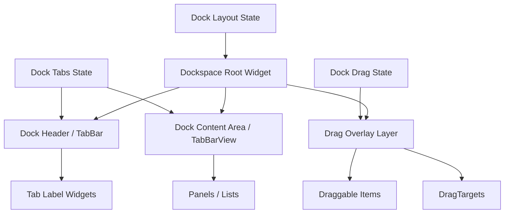
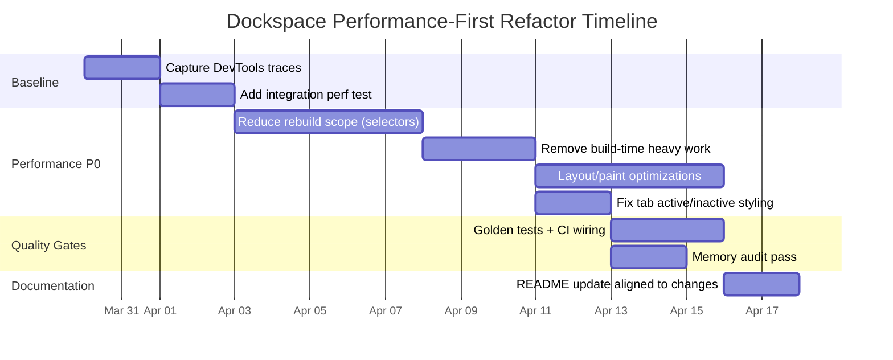

# Performance-First Audit Playbook for a Flutter Dockspace Component

## Executive summary

This report provides a **comprehensive, actionable audit checklist + templates** to ensure a Flutter UI component—specifically `packages/intelag_flutter_ui_kit/lib/src/components/dockspace`—is:

- **Performance-optimized first**
- **Modular/readable second**
- **Well-documented (README/docs) third**

The hierarchy is enforced as **gates**: you do not “graduate” to modular refactors until you can demonstrate (with profiling + measurable budgets) that the component is not introducing avoidable jank or rebuild thrash. This approach is aligned with Flutter’s own guidance to **avoid costly work in `build()`**, to **reduce rebuild scope**, and to **profile in profile mode** instead of relying on debug behaviors.

### Definition of “done” for Dockspace

A Dockspace refactor should be considered complete only when all of these are true:

- The component meets a defined **frame timing budget** (frame build + raster) using **percentile metrics** (avg, p90, p99, worst).
- Widget rebuild hotspots are identified via DevTools and reduced (using **rebuild stats / widget build counts**).
- The **tab active/inactive styling bug is fixed** in a theme-correct way (no hardcoded colors that override TabBar states).
- A README section exists that matches current architecture, state management approach, performance strategies, and usage examples.

## Profiling and measurable metrics

A Dockspace component is typically sensitive to performance because it often combines **tabs**, **lists/panels**, and sometimes **drag/drop**. Flutter’s performance model is framed around hitting **~16ms per frame for 60fps** (or ~8ms on 120Hz devices), and DevTools provides direct instrumentation for UI vs raster cost and janky frames.

### Required measurement baselines

You should define a baseline scenario that represents real Dockspace usage (example):

- Open Dockspace with N tabs (e.g., 10–30)
- Switch tabs rapidly
- Scroll any list/panel inside a tab
- Drag a dock item across multiple targets (if supported)
- Trigger any animations (hover/press/resize)

**Budget metrics to record (minimum):**
- Frame timing statistics: `buildDuration` and `rasterDuration` with **avg / p90 / p99 / worst**.
- Count of janky frames and their causes (UI vs raster).
- Widget rebuild counts (top rebuilders). DevTools supports “track widget builds” and rebuild stats tooling.

### Profiling workflow you should standardize

**Use profile mode for performance.** Flutter guidance is explicit: use profile mode to analyze performance; debug mode frame times are not representative.

**Primary tools and what you extract from each:**
- **DevTools Performance view**: frames chart, jank frames, frame analysis, timeline events, and advanced tracing toggles.
- **Rebuild diagnostics**:
  - DevTools widget build counts / Rebuild Stats.
  - Console logging for “dirty widgets built each frame” (use sparingly): `debugPrintRebuildDirtyWidgets`.
  - Timeline tracing flags for builds/layouts/paints: `debugProfileBuildsEnabled`, `debugProfileLayoutsEnabled`, `debugProfilePaintsEnabled` (note these add overhead and are for debugging patterns, not final timing).
- **DevTools Inspector visual debugging**:
  - “Highlight repaints” (to find unexpected large repaint regions).
  - “Highlight oversized images” (to catch memory-heavy images).
- **DevTools Memory view**:
  - Track heap/native memory, raster cache size, and use “Diff snapshots” / “Trace instances” to locate allocation churn and leaks.

### Automated performance measurement via integration tests

Flutter supports measuring performance via integration tests that record timelines and summarize frame timings.

Two key APIs:
- `IntegrationTestWidgetsFlutterBinding.traceAction()` records a timeline during an action.
- `IntegrationTestWidgetsFlutterBinding.watchPerformance()` watches `FrameTiming` during an action and reports a summary.

This is the backbone for CI performance budgets.

## Performance-first checklist

This checklist is **prioritized** and **enforces hierarchy**. Items marked **P0** are performance gates: you do not proceed to broad modular refactors until P0 issues are resolved (or explicitly accepted with documented rationale and a measured impact).

Each item includes: **rationale**, **detection**, **remediation** (with before/after snippet), **risk/impact**, and **tests**.

### P0 item: establish budgets and a reproducible benchmark

**Rationale.** Optimization without measurement risks complexity without benefit; Riverpod documentation explicitly cautions to benchmark before optimizing.
Flutter also recommends monitoring percentile frame metrics (avg/p90/p99/worst).

**Detection.**
- Baseline profiling capture in DevTools Performance view (profile build).
- CI performance test using `watchPerformance()` for a Dockspace scenario.

**Remediation (template).**

Before (no budgets, subjective “feels fast”):
```dart
testWidgets('dockspace works', (tester) async {
  await tester.pumpWidget(const MyApp());
  // interact a bit...
});
```

After (budgeted performance test):
```dart
import 'package:integration_test/integration_test.dart';
import 'package:flutter_test/flutter_test.dart';

void main() {
  final binding = IntegrationTestWidgetsFlutterBinding.ensureInitialized();

  testWidgets('dockspace perf budget', (tester) async {
    await tester.pumpWidget(const MyApp());

    await binding.watchPerformance(() async {
      // TODO: drive dockspace scenario: open, switch tabs, drag, scroll
      // Must last long enough to collect FrameTimings.
      await tester.fling(find.byType(Scrollable), const Offset(0, -800), 2000);
      await tester.pumpAndSettle();
    }, reportKey: 'dockspace_perf');
  });
}
```

**Risk/impact.** medium effort, high payoff: enables safe refactors and regression detection.

**Tests.**
- Integration/perf test with `watchPerformance()` summary output.
- Optional: timeline capture with `traceAction()` for deeper event analysis.

### P0 item: reduce rebuild scope and rebuild frequency

**Rationale.** Flutter warns that `build()` can be invoked frequently; avoid expensive work and avoid large monolithic widgets.
DevTools supports “track widget builds” and rebuild counts to diagnose hotspots.

**Detection.**
- DevTools rebuild stats / widget build counts show high build counts on Dockspace root or large subtrees.
- Console: `debugPrintRebuildDirtyWidgets = true` (short sessions only).

**Remediation pattern: split static vs dynamic + push state listening down.**

Before (broad rebuild blast radius):
```dart
@override
Widget build(BuildContext context) {
  final dock = context.watch<DockspaceController>(); // broad listen
  return Column(
    children: [
      DockHeader(tabs: dock.tabs, active: dock.activeIndex),
      DockBody(dock: dock), // receives broad state
    ],
  );
}
```

After (narrow listening + smaller rebuild surfaces):
```dart
@override
Widget build(BuildContext context) {
  return const Column(
    children: [
      _DockHeader(),
      Expanded(child: _DockBody()),
    ],
  );
}

class _DockHeader extends StatelessWidget {
  const _DockHeader();

  @override
  Widget build(BuildContext context) {
    final active = context.select((DockspaceController c) => c.activeIndex);
    final tabTitles = context.select((DockspaceController c) => c.tabTitles);
    return DockHeader(titles: tabTitles, activeIndex: active);
  }
}

class _DockBody extends StatelessWidget {
  const _DockBody();

  @override
  Widget build(BuildContext context) {
    final activeTabModel = context.select((DockspaceController c) => c.activeTabModel);
    return DockBody(tabModel: activeTabModel);
  }
}
```

This principle is explicitly recommended by Provider (`context.select` to avoid rebuilding when unrelated fields change).
It also matches Flutter guidance to “push changing parts to the leaves” to reduce rebuild cost.

**Risk/impact.** high impact: often the single largest win for “dock-like” UIs.

**Tests.**
- Widget tests asserting behavior is unchanged.
- Optional diagnostic test (debug-only) that verifies rebuild counts for key widgets do not exceed a threshold during a simulated interaction (paired with DevTools manual validation).

### P0 item: use `const` and subtree caching aggressively

**Rationale.**
- Flutter recommends using `const` widgets where possible; it is equivalent to caching and reusing widgets/subtrees.
- Flutter also documents that reusing a widget stored in a `final` state variable is “massively more efficient” than recreating it.
- Lints exist to enforce this (`prefer_const_constructors`, `prefer_const_literals_to_create_immutables`).

**Detection.**
- Static: enable `flutter_lints` and required const-related lints.
- Runtime: rebuild stats still showing “static” subtrees rebuilding suggests missing const or caching boundaries.

**Remediation pattern A: const constructors and const children.**

Before:
```dart
return Padding(
  padding: EdgeInsets.all(8),
  child: Text('Dockspace'),
);
```

After:
```dart
return const Padding(
  padding: EdgeInsets.all(8),
  child: Text('Dockspace'),
);
```

**Remediation pattern B: cache stable subtree in State.**

Before:
```dart
class DockspaceShell extends StatefulWidget {
  const DockspaceShell({super.key});
  @override
  State<DockspaceShell> createState() => _DockspaceShellState();
}

class _DockspaceShellState extends State<DockspaceShell> {
  @override
  Widget build(BuildContext context) {
    return _buildChrome(); // rebuilds chrome every time parent rebuilds
  }

  Widget _buildChrome() => DockChrome(/* heavy */);
}
```

After (cache stable chrome):
```dart
class _DockspaceShellState extends State<DockspaceShell> {
  late final Widget _chrome = const DockChrome();

  @override
  Widget build(BuildContext context) {
    return _chrome;
  }
}
```

Caching strategies are directly documented as preferred for performance.

**Risk/impact.** low risk; medium-to-high payoff depending on subtree size.

**Tests.**
- Golden tests for stable chrome appearance.
- Widget tests verifying chrome still renders expected structure.

### P0 item: eliminate expensive computation and allocation inside `build()`

**Rationale.** Flutter “performance best practices” warn against repetitive/costly work in `build()` because it may run frequently.

**Detection.**
- Static grep patterns (examples): `..sort(`, `.map(...).toList()`, heavy string building, JSON decoding, expensive search/filter inside `build()`.
- Runtime: DevTools timeline shows long “build” segments; rebuild stats show costly widgets called frequently.

**Remediation: move compute to controller, memoize derived state, or compute on input change.**

Before:
```dart
@override
Widget build(BuildContext context) {
  final tabs = context.watch<DockspaceController>().tabs;
  final visible = tabs.where((t) => t.isVisible).toList()
    ..sort((a, b) => a.order.compareTo(b.order)); // repeated every rebuild
  return DockTabBar(tabs: visible);
}
```

After (derive once in controller; UI reads derived result):
```dart
class DockspaceController extends ChangeNotifier {
  List<DockTab> _tabs = [];
  List<DockTab> _cachedVisibleSorted = const [];
  bool _dirtyVisible = true;

  List<DockTab> get visibleSortedTabs {
    if (_dirtyVisible) {
      final next = _tabs.where((t) => t.isVisible).toList()
        ..sort((a, b) => a.order.compareTo(b.order));
      _cachedVisibleSorted = List.unmodifiable(next);
      _dirtyVisible = false;
    }
    return _cachedVisibleSorted;
  }

  void setTabs(List<DockTab> tabs) {
    _tabs = tabs;
    _dirtyVisible = true;
    notifyListeners();
  }
}

@override
Widget build(BuildContext context) {
  final tabs = context.select((DockspaceController c) => c.visibleSortedTabs);
  return DockTabBar(tabs: tabs);
}
```

This uses the foundational principle: work should not repeat on every rebuild; rebuild frequency is not stable and must be assumed high.

**Risk/impact.** medium risk if caching invalidation is incorrect; high performance impact if heavy list transforms were in `build()`.

**Tests.**
- Unit test: controller invalidates cached derived values when inputs change.
- Widget test: correct tab ordering for different input sets.

### P0 item: enforce fine-grained state listening

**Rationale.**
- Provider explicitly documents `context.select` as the key tool when `watch` is too broad.
- Riverpod provides a similar approach (`select`) and cautions to benchmark before adding complexity.
- Flutter docs emphasize pushing frequently-changing dependencies to the leaves.

**Detection.**
- Static patterns to flag:
  - Provider: `context.watch<T>()` in high-level widgets, `Consumer<T>` wrapping huge subtrees, `Provider.of<T>(context)` with default listening.
  - Riverpod: `ref.watch(provider)` returning big state objects in large widgets.
  - ChangeNotifier: `addListener` that triggers broad `setState` without boundary widgets.
- Runtime: rebuild stats showing high rebuild count in container widgets rather than leaf widgets.

**Remediation examples across common approaches.**

Provider (before/after):
```dart
// Before
final state = context.watch<DockState>();
return Text(state.activeTabTitle);

// After
final title = context.select((DockState s) => s.activeTabTitle);
return Text(title);
```

Riverpod (before/after):
```dart
// Before
final state = ref.watch(dockProvider);
return Text(state.activeTabTitle);

// After
final title = ref.watch(dockProvider.select((s) => s.activeTabTitle));
return Text(title);
```
Riverpod’s documentation discusses rebuild reduction strategies and selective watching.

ValueNotifier (before/after):
```dart
// Before: setState rebuilds whole screen for a small value change.
setState(() => _activeIndex = i);

// After: only the ValueListenableBuilder subtree rebuilds.
final activeIndex = ValueNotifier<int>(0);

ValueListenableBuilder<int>(
  valueListenable: activeIndex,
  builder: (context, index, _) => DockTabBar(activeIndex: index),
);
```
ValueListenableBuilder is designed for rebuilding on a listenable change and supports a `child` parameter to avoid rebuilding stable subtrees.

**Risk/impact.** high positive impact; low-to-medium risk if state is refactored carefully.

**Tests.**
- Widget tests for state-driven UI changes.
- “Rebuild budget” manual verification via DevTools rebuild stats after implementing selective listening.

### P0 item: optimize animations and high-frequency interactions (drag/drop, hover, resize)

**Rationale.** high-frequency input loops (pointer move/drag) can cause per-frame rebuild storms if implemented with broad `setState`. Flutter provides patterns like `AnimatedBuilder` with a cached `child` to avoid rebuilding large subtrees.

**Detection.**
- DevTools Performance view shows janky frames during drag; timeline shows heavy build work per pointer event.
- Rebuild stats show tab bar / dock root rebuilding excessively while dragging.
- Inspect drag/drop usage via Draggable/DragTarget callbacks (`onDragUpdate` etc.) which fire frequently.

**Remediation: isolate drag position into a ValueNotifier + paint boundary.**

Before:
```dart
onDragUpdate: (details) => setState(() => _cursor = details.globalPosition),
```

After:
```dart
final dragPos = ValueNotifier<Offset>(Offset.zero);

onDragUpdate: (details) => dragPos.value = details.globalPosition,

ValueListenableBuilder<Offset>(
  valueListenable: dragPos,
  child: const DockStaticChrome(), // stable subtree
  builder: (context, pos, child) {
    return Stack(
      children: [
        child!,
        Positioned(left: pos.dx, top: pos.dy, child: const DockDragPreview()),
      ],
    );
  },
);
```

If paint becomes the bottleneck, a targeted `RepaintBoundary` can contain repaints and sometimes enable raster caching of a complex static subtree.

**Risk/impact.** high performance impact for interactive UIs; moderate architectural impact.

**Tests.**
- Integration test: simulate drag path and assert no crashes and correct drop behavior (DragTarget acceptance).
- Performance test: `watchPerformance()` around drag scenario.

### P0 item: list and tab rendering efficiency

**Rationale.**
- `shrinkWrap` is explicitly documented as “significantly more expensive” because size must be recomputed during scrolling.
- Lists should use builder patterns and fixed extents when possible; ListView supports `itemExtent` and `prototypeItem` to enforce consistent child extents (which helps the scrollable compute layout more efficiently).

**Detection.**
- Static: search for `shrinkWrap: true` under Dockspace; search for nested `ListView` inside `Column` with unbounded constraints (often “fixed” with shrinkWrap).
- Runtime: jank during scroll; high layout time in timeline.

**Remediation A: remove shrinkWrap by using proper layout constraints.**

Before:
```dart
Column(
  children: [
    Header(),
    ListView.builder(
      shrinkWrap: true,
      physics: const NeverScrollableScrollPhysics(),
      itemBuilder: ...
    ),
  ],
)
```

After:
```dart
Column(
  children: [
    const Header(),
    Expanded(
      child: ListView.builder(
        itemBuilder: ...
      ),
    ),
  ],
)
```

**Remediation B: use `itemExtent` or `prototypeItem` if rows have a stable height.**

Before:
```dart
ListView.builder(
  itemBuilder: (_, i) => DockRow(item: items[i]),
)
```

After:
```dart
ListView.builder(
  itemExtent: 40, // if stable
  itemBuilder: (_, i) => DockRow(item: items[i]),
)
```

**Risk/impact.** Often high payoff; risk is mainly layout correctness.

**Tests.**
- Widget tests for list layout and scroll interaction.
- Performance test: scroll scenario from Flutter cookbook pattern.

### P0 item: avoid intrinsic sizing and speculative layout passes

**Rationale.** Intrinsic widgets (e.g., IntrinsicWidth) are documented as “relatively expensive,” adding speculative layout that can be O(N²) in tree depth.

**Detection.**
- Static: search for `IntrinsicWidth`, `IntrinsicHeight` in Dockspace.
- Runtime: high layout cost; repeated relayout in timelines.

**Remediation: replace with constraint-based layouts (Align, SizedBox, Flex) or compute constraints differently.**

Before:
```dart
IntrinsicWidth(
  child: Column(children: [...]),
)
```

After:
```dart
Align(
  alignment: Alignment.centerLeft,
  child: ConstrainedBox(
    constraints: const BoxConstraints(maxWidth: 320),
    child: Column(children: [...]),
  ),
)
```

**Risk/impact.** high performance upside if intrinsic was in a hot path; moderate refactor risk.

**Tests.**
- Widget tests verifying width behavior under different constraints.
- Golden tests if layout visuals matter.

### P0 item: reduce paint cost, avoid implicit `saveLayer`, use RepaintBoundary intentionally

**Rationale.**
- Flutter documents `saveLayer` as one of the most expensive framework methods; it may be triggered implicitly by `Clip.antiAliasWithSaveLayer`.
- RepaintBoundary can improve performance by containing repaints and sometimes enabling caching, but can be counterproductive if parent/child repaint together (extra layers).

**Detection.**
- DevTools Performance view: high raster time; frame analysis hints at expensive operations (clips, shadows, saveLayer).
- Inspector “Highlight repaints” shows large repaint regions when only a small part changes.
- Static: grep for `clipBehavior: Clip.antiAliasWithSaveLayer`, `Opacity(` wrapping large subtrees, heavy shadows/blur.

**Remediation examples.**

Before (implicit saveLayer via clip):
```dart
ClipRRect(
  clipBehavior: Clip.antiAliasWithSaveLayer,
  borderRadius: BorderRadius.circular(16),
  child: dockBody,
)
```

After (avoid saveLayer unless required; consider alternatives):
```dart
ClipRRect(
  clipBehavior: Clip.antiAlias, // prefer if acceptable
  borderRadius: BorderRadius.circular(16),
  child: dockBody,
)
```

Before (large subtree opacity):
```dart
Opacity(
  opacity: 0.8,
  child: EntireDockspace(),
);
```

After (apply opacity locally, or redesign effect):
```dart
// apply only where needed, not to whole scene
Icon(Icons.close, color: theme.colorScheme.onSurface.withOpacity(0.8));
```

**Risk/impact.** high performance impact for raster bottlenecks; moderate visual regression risk.

**Tests.**
- Golden tests for visual changes (opacity, clipping, corners).
- Manual verification with “Highlight repaints” and raster time changes.

### P0 item: image and asset handling (memory + decode + caching)

**Rationale.**
- The Image API documents that large images are stored uncompressed and can be extremely memory heavy; it recommends `cacheWidth/cacheHeight` to decode at display size, dramatically reducing memory usage.
- `precacheImage` can load images ahead of time into the image cache for smoother interactions (with careful memory discipline).
- Flutter provides `debugInvertOversizedImages` and Inspector “highlight oversized images” to detect oversized decodes and recommends resizing assets or using cacheWidth/cacheHeight/ResizeImage.
- ImageCache is an LRU cache (defaults up to 1000 images / 100MB), configurable via `maximumSize` and `maximumSizeBytes`.

**Detection.**
- Enable Inspector “Highlight oversized images” and/or set `debugInvertOversizedImages = true` in debug sessions.
- Memory view: rising native memory, raster cache spikes during tab switches.

**Remediation examples.**

Before (decoding full-size):
```dart
Image.asset('assets/huge_bg.png');
```

After (decode near display size):
```dart
Image.asset(
  'assets/huge_bg.png',
  cacheWidth: 800,  // compute based on layout * devicePixelRatio
  cacheHeight: 450,
);
```

Before (loading during interaction causes flicker):
```dart
onHover: (_) => setState(() => _showPreview = true);
```

After (precache on warm-up):
```dart
@override
void didChangeDependencies() {
  super.didChangeDependencies();
  precacheImage(const AssetImage('assets/dock_preview.png'), context);
}
```

**Risk/impact.** high impact for memory + jank; risk is memory pressure if you over-precache or pin large images.

**Tests.**
- Golden tests for image rendering correctness.
- Manual oversized-image check via Inspector.
- Optional memory regression test scenario (manual) using Memory view diff snapshots.

### P0 item: fix Tab active/inactive color bug in a theme-correct way

**Observed symptom.** “Tabs are shown in the same color without any changes.”

**Rationale.**
- TabBar has explicit properties for `labelColor` and `unselectedLabelColor`, and TabBarTheme can define defaults.
- In Material 3, defaults are derived from `ColorScheme` unless overridden.
- If `labelColor` uses a `WidgetStateColor`, unselected color can resolve from widget states.
- Flutter migrated MaterialState APIs to WidgetState APIs; using WidgetState properties is the forward-compatible pattern.

**Detection.**
- Static: find where the tab label text/icon color is set:
  - If you wrap label with `Text(style: TextStyle(color: ...))`, TabBar’s labelColor may not apply.
  - If you draw custom tabs, you may be bypassing TabBar state styling.
- Runtime: switching tabs does not change visual state; golden tests can catch this regression.

**Remediation option A: use TabBar’s built-in label colors (preferred).**

Before (hardcoded color inside tab widget):
```dart
Tab(
  child: Text(
    title,
    style: const TextStyle(color: Colors.grey), // overrides selection
  ),
);
```

After (allow TabBar to apply selected/unselected styling):
```dart
Tab(text: title);
```

And configure TabBar:
```dart
TabBar(
  labelColor: Theme.of(context).colorScheme.primary,
  unselectedLabelColor: Theme.of(context).colorScheme.onSurfaceVariant,
  tabs: tabs.map((t) => Tab(text: t.title)).toList(),
);
```
ColorScheme defaults and unselected behavior are documented by TabBar’s API.

**Remediation option B: if a custom tab widget is required, drive color from TabController state.**

Before:
```dart
class DockTabLabel extends StatelessWidget {
  final String title;
  const DockTabLabel(this.title, {super.key});

  @override
  Widget build(BuildContext context) {
    return Text(title, style: TextStyle(color: Theme.of(context).colorScheme.primary));
  }
}
```

After (resolve selected/unselected via TabController index):
```dart
class DockTabLabel extends StatelessWidget {
  final int index;
  final String title;
  const DockTabLabel({required this.index, required this.title, super.key});

  @override
  Widget build(BuildContext context) {
    final controller = DefaultTabController.of(context);
    final cs = Theme.of(context).colorScheme;

    return AnimatedBuilder(
      animation: controller,
      builder: (_, __) {
        final selected = controller.index == index;
        return Text(
          title,
          style: TextStyle(color: selected ? cs.primary : cs.onSurfaceVariant),
        );
      },
    );
  }
}
```

`DefaultTabController` exists to share a TabController with TabBar/TabBarView.
Using AnimatedBuilder correctly can reduce rebuild work by keeping stable subtrees out of the builder (via `child`) when needed.

**Risk/impact.** low-to-medium risk (visual regressions); high UX impact.

**Tests.**
- Widget test: tapping tab changes style (selected vs unselected).
- Golden test: render selected/unselected states on at least one theme variant.

### P0 item: memory stability and leak prevention in Dockspace

**Rationale.** Complex UI components frequently own controllers (TabController, ScrollController, Drag controllers, AnimationControllers). Failing to dispose or unintentionally retaining references will show up as memory growth and can degrade responsiveness. DevTools Memory view supports diff snapshots and trace instances to find allocation churn.

**Detection.**
- DevTools Memory view:
  - Heap and native memory that only increases after repeated interactions (tab switching, open/close panels).
  - Use diff snapshots and trace instances.

**Remediation example.**

Before:
```dart
class _DockState extends State<DockWidget> {
  final _scroll = ScrollController(); // never disposed
}
```

After:
```dart
class _DockState extends State<DockWidget> {
  final _scroll = ScrollController();

  @override
  void dispose() {
    _scroll.dispose();
    super.dispose();
  }
}
```

**Risk/impact.** high correctness impact; medium effort depending on how many controllers exist.

**Tests.**
- Integration test: repeat navigation and interactions; manually verify memory stabilizes using Memory view.
- Add unit tests for controllers/notifiers lifecycle where feasible (e.g., controller factory returns disposable types).

## Modularity and readability checklist

This section is intentionally second: performance gates should be satisfied first. The modularity checklist focuses on keeping Dockspace **maintainable without broadening rebuild scope**—a key risk in refactors.

### M item: split by responsibility and rebuild boundary, not by file size alone

**Rationale.** Flutter recommends avoiding overly large single widgets; splitting widgets can reduce rebuild overhead when done along “change boundaries.”

**Detection.**
- One `build()` method manages tabs + body + drag logic + keyboard shortcuts + theming.
- Frequent changes (drag position) cause unrelated subtrees to rebuild.

**Remediation.**

Before:
```dart
class Dockspace extends StatelessWidget {
  @override
  Widget build(BuildContext context) {
    // tab header, body, drag overlay, theme, compute lists...
  }
}
```

After:
```dart
class Dockspace extends StatelessWidget {
  const Dockspace({super.key});

  @override
  Widget build(BuildContext context) {
    return const Stack(
      children: [
        _DockLayout(),
        _DockDragOverlay(),
      ],
    );
  }
}
```

Drive state in each leaf widget using selectors / select.

**Risk/impact.** medium: improves readability and can improve performance; risk is introducing extra abstraction without payoff.

**Tests.**
- Widget tests per extracted widget.
- Behavior tests verifying interactions remain correct.

### M item: enforce state boundaries and avoid “mega controllers”

**Rationale.** Fine-grained state reduces rebuild scope and improves reasoning. Provider and Riverpod both encourage selective listening rather than watching broad state objects.

**Detection.**
- A single controller has tabs + drag data + layout data + theme overrides + persistence.
- Widgets watch the whole state for one field.

**Remediation.**
- Split state by responsibility:
  - `DockTabsState` (tabs, active index)
  - `DockDragState` (drag position, drag payload)
  - `DockLayoutState` (pane sizes, constraints)
- Expose derived getters for expensive computed values to avoid recomputing in build (ties to P0).

**Risk/impact.** medium: improves testability; careful not to increase provider nesting overhead.

**Tests.**
- Unit tests for state transitions (tab changes, drag enter/leave, layout updates).
- Widget tests that verify only intended subtrees update (manual DevTools corroboration).

### M item: remove helper-method UI builders in favor of widgets

**Rationale.** Flutter documents that reusable UI should prefer widgets over helper methods; widgets enable more efficient re-rendering, especially with `const`.

**Detection.**
- Repeated patterns like `_buildHeader()`, `_buildTab()`, `_buildDockItem()` returning widget trees.

**Remediation.**

Before:
```dart
Widget _buildTab(DockTab t) => Padding(...);
```

After:
```dart
class DockTabWidget extends StatelessWidget {
  final DockTab tab;
  const DockTabWidget({required this.tab, super.key});

  @override
  Widget build(BuildContext context) => Padding(...);
}
```

**Risk/impact.** low-to-medium; often improves testability and enables const.

**Tests.**
- Golden tests for visual components that are now self-contained widgets.

### M item: static analysis configuration as a modularity “guardrail”

**Rationale.** Dart analysis options allow consistent enforcement of lint rules and strictness; the analyzer supports an `analysis_options.yaml` and a single `include` entry, with additional customization.

**Detection.**
- No enforced lints, inconsistent style, missed const opportunities.

**Remediation (recommended baseline).**
- Use `flutter_lints` as base.
- Add/ensure performance-oriented rules like `prefer_const_constructors` and `prefer_const_literals_to_create_immutables`.

**Tests.**
- CI gate: `flutter analyze` must pass.

## README and documentation checklist

Documentation is third by design. It should be updated after performance and modularity work stabilizes, to avoid churn and to ensure the README reflects the true current architecture.

### D item: README must document performance strategy and how to verify it

**Rationale.** Flutter provides official workflows for profiling with DevTools and for measuring performance with integration tests. Documentation should show how contributors repeat your measurements.

**Detection.**
- README describes features but not performance budgets, not how to profile, not how to run perf tests.

**Remediation (README snippet template).**

Before:
```md
## Dockspace
A dock UI component.
```

After:
```md
## Dockspace

### Performance goals
- Target: 60fps (<= ~16ms per frame) on supported devices.
- Budgets: frame build + raster monitored via integration perf tests (avg/p90/p99/worst).

### How to profile locally
1) Run in profile mode
2) Open DevTools Performance view
3) Enable “Track widget builds” to inspect rebuild counts
```

Frame timing expectations and DevTools workflow are grounded in Flutter’s performance documentation.

**Tests.**
- CI should generate perf test artifacts (JSON outputs) and attach to build logs.

### D item: document theming and tab active/inactive styling rules

**Rationale.** TabBar styling behavior (label/unselected colors, Material 3 defaults, WidgetStateColor resolution) is nuanced; documenting it prevents regressions like “tabs always the same color.”

**Detection.**
- README does not specify how themes determine tab colors or how to customize.

**Remediation (README snippet).**
- Explain:
  - default uses ThemeData/ColorScheme
  - supported overrides via `TabBarThemeData` or TabBar props
  - do **not** hardcode colors inside tab label widgets unless you manually drive selected/unselected state

**Tests.**
- Golden tests for selected/unselected on light and dark theme variants.

### D item: keep docs aligned via golden tests and examples

**Rationale.** Golden tests provide a pixel baseline; Flutter documents `matchesGoldenFile` and updating goldens via `flutter test --update-goldens`.

**Detection.**
- Visual regressions slip in (tab colors, spacing, density) unnoticed.

**Remediation.**
- Add golden tests for:
  - tab header (selected/unselected)
  - dock tiles
  - empty state vs populated state

**Tests.**
- Golden test suite in CI.

## Audit template, CI gates, and refactor workflow

This section provides the templates you requested: a file-level audit table, CI gates, diagrams, workflow, and sample fixes tailored to Dockspace.

### File-level audit template

Use this table **per source file** under `packages/intelag_flutter_ui_kit/lib/src/components/dockspace`.

| File | Role/Responsibility | Hot path? (Y/N) | Rebuild hotspots (what rebuilds too much?) | State listening issues | Build-time heavy work | Layout risks (shrinkWrap/intrinsic) | Paint risks (saveLayer/clip/opacity) | Image/asset risks | Theming/tab styling risks | Findings summary | Priority (P0/P1/P2) | Effort (XS/S/M/L/XL) | Proposed fix | Tests to add/update | Status |
|---|---|---:|---|---|---|---|---|---|---|---|---|---|---|---|---|
| `dockspace.dart` | Root widget |  |  |  |  |  |  |  |  |  |  |  |  |  |  |
| `dock_tab_bar.dart` | Tabs header |  |  |  |  |  |  |  |  |  |  |  |  |  |  |
| `dock_drag_layer.dart` | Drag overlay |  |  |  |  |  |  |  |  |  |  |  |  |  |  |
| … | … |  |  |  |  |  |  |  |  |  |  |  |  |  |  |

Recommended scoring rule:
- **P0**: causes jank/rebuild storms, breaks tab styling state, heavy build/layout/paint costs, oversized images.
- **P1**: maintainability issues that increase rebuild scope risk.
- **P2**: cleanup, naming, docs, minor refactors.

### CI gates and automated checks

These gates attempt to convert the checklist into enforceable automation.

**Static gates (must pass on every PR):**
- `flutter analyze` with `flutter_lints` enabled.
- Enable/require:
  - `prefer_const_constructors`
  - `prefer_const_literals_to_create_immutables`

**Widget + golden gates:**
- Run widget tests including goldens; update goldens only via explicit workflow.
- Golden tests use `matchesGoldenFile`; update via `flutter test --update-goldens`.

**Performance budget gates:**
- Integration perf test(s) using `watchPerformance()` and/or `traceAction()` around Dockspace interactions.
- Budgets should validate **avg / p90 / p99 / worst** for build/raster durations.
- Note: perf variability on shared CI runners is real; treat hard failures carefully (use baselines, stable runners, or compare to a pinned reference). The tooling still provides regression signals even if you add tolerance bands.

**Memory regression gates (optional but valuable for complex dock UIs):**
- Not typically “hard-fail” in CI, but you can enforce:
  - No obvious leaks by repeating interactions and ensuring disposal correctness.
  - Manual review checklist using DevTools memory diff snapshots / trace instances.

### Sample Dockspace refactor workflow with effort estimates

Effort scale:
- **XS**: < half-day
- **S**: 0.5–1 day
- **M**: 1–3 days
- **L**: 3–5 days
- **XL**: 1–2 weeks

Workflow steps:
1) **Baseline capture (S)**
   Record DevTools Performance + rebuild stats; add a first `watchPerformance()` test.

2) **Fix P0 rebuild scope (M–L)**
   Convert broad watches to selects; push listeners down; split root widget.

3) **Fix P0 build-time work (M)**
   Move list transforms/sorts/derivations out of `build()`; cache derived values.

4) **Fix P0 layout/paint hotspots (M–L)**
   Remove shrinkWrap where possible; remove intrinsic sizing; reduce saveLayer triggers; apply RepaintBoundary only where justified.

5) **Fix tab color active/inactive bug (S)**
   Remove hardcoded colors in tab children; use TabBar label/unselected colors or TabController-driven styling.

6) **Add/expand goldens + docs (S–M)**
   Goldens for tab visuals and Dockspace states; README updates.

### Mermaid diagrams

Component relationship diagram (template to adapt to your actual classes):



Refactor timeline (sample Gantt-style; adjust to your team’s cadence):



### README update template

Use the following structure inside your repo README (or a module-level README under dockspace):

```md
## Dockspace

Dockspace is a tabbed, dock-style UI component located at:
`packages/intelag_flutter_ui_kit/lib/src/components/dockspace`

### Architecture
- **Dockspace Root**: composition, layout boundaries
- **Tab Header**: TabBar / tab widgets
- **Content Area**: tab content rendering
- **Drag Layer**: drag preview + drop targets (if enabled)
- **State**: (Provider/Riverpod/ValueNotifier) and how it is scoped

### Performance goals
- Target smooth UI at 60fps (<= ~16ms/frame; device-dependent).
- Perf budgets tracked via integration tests:
  - buildDuration/rasterDuration: avg, p90, p99, worst
  - rebuild hotspots monitored via DevTools rebuild stats

### How to profile
1. Run a profile build
2. Open DevTools → Performance view
3. Enable “Track widget builds” to find rebuild hotspots
4. Use Inspector → Highlight repaints / oversized images for paint/memory issues

### State management conventions
- Watch/select only the smallest state slice needed by a widget.
- Avoid broad watches in high-level widgets.
- Derived state is computed/cached outside of build methods.

### Theming & tab selection visuals
- Selected and unselected tab colors are driven by TabBar/TabBarTheme.
- Do not hardcode tab label colors inside tab children unless explicitly driven by TabController.

### Test coverage
- Widget tests for interaction logic
- Golden tests for tab header and key dock states
- Integration perf tests for scrolling/tab switching/drag scenarios

### Common pitfalls
- shrinkWrap in scrolling lists
- IntrinsicWidth/IntrinsicHeight in hot paths
- saveLayer from Clip.antiAliasWithSaveLayer
- Oversized images missing cacheWidth/cacheHeight
```

This template deliberately documents the same core workflows Flutter expects: profile-mode performance analysis, DevTools Performance tooling, golden testing, and integration performance tests.