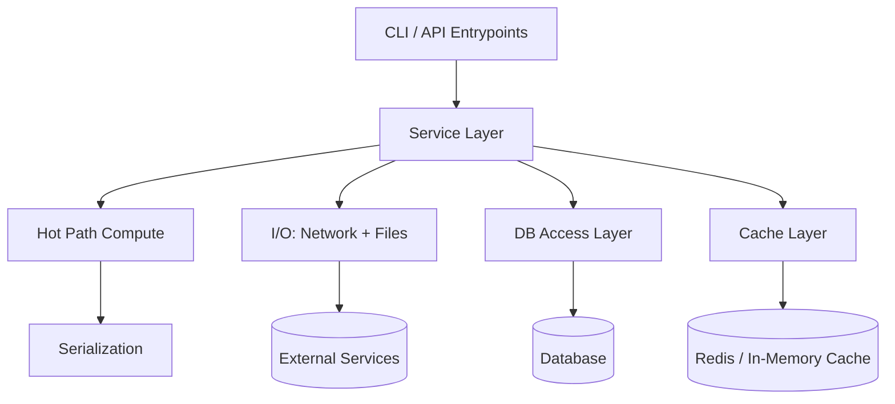
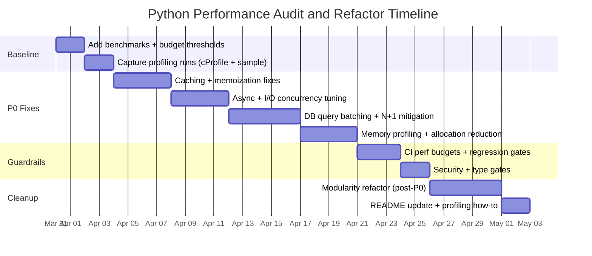

# Python Performance Audit Playbook

## Canonical Source: python-performance-audit-playbook.md

## Section Break
doc_version: 1.0.0
## Section Break
# Comprehensive Performance-First Audit Playbook for Python Projects

## Executive Summary

This playbook establishes an exhaustive, actionable audit system for optimizing the performance, modularity, security, and maintainability of Python projects. The architectural paradigm enforced herein is strictly hierarchical:

1. **Performance** — Measured, profiled, regression-protected (P0)
2. **Modularity / Readability** — Refactored without regressing performance (M)
3. **Documentation** — Updated only after behavior and performance stabilize (D)

**Core principle:** You don't refactor what you haven't measured, and you don't document what you haven't stabilized. The Python standard library profiling docs explicitly warn that profilers are designed for execution profiling, not benchmarking — use dedicated tools like `timeit`, `pytest-benchmark`, or `pyperf` for accuracy.

## The Architectural Philosophy and the Definition of Done

A refactoring cycle, optimization pass, or feature implementation is classified as "done" exclusively when the following systemic criteria are satisfied:

### Completion Criteria

| Metric | Measurement Methodology | Target Threshold |
| :--- | :--- | :--- |
| **Latency Budgets** | `pytest-benchmark` / `pyperf` regression tests | p50/p95/p99 wall-clock time within defined bounds per workload |
| **Throughput** | Benchmark harness under load | req/s, jobs/min, rows/s meet or exceed baseline |
| **CPU Hotspot Elimination** | `cProfile`, `py-spy`, `pyinstrument` | Top hot paths are optimized; no unaddressed cumtime dominators |
| **Memory Stability** | `tracemalloc` snapshot diffing | No monotonic growth after repeated workload execution |
| **Query Efficiency** | SQL logging + `EXPLAIN ANALYZE` | Zero N+1 patterns; all hot queries have validated plans |
| **Static Analysis** | `flake8` / `pylint` / `mypy --strict` / `bandit` | Zero errors across all gates |
| **Test Coverage** | `pytest` with `--benchmark-compare-fail` | Correctness + performance regression tests pass in CI |

## Profiling Workflows and Measurable Baselines

### Decide What "Performance" Means

Before making any change, define target metrics and thresholds:

| Metric Category | What to Track | Why It Matters | Typical Tool(s) |
| :--- | :--- | :--- | :--- |
| **Latency** | p50 / p95 / p99 wall-clock time per request/job | Captures tail latency and variability | `pyperf` stats/percentiles; app metrics |
| **Throughput** | req/s, jobs/min, rows/s | Verifies work capacity | App metrics; benchmark harness |
| **CPU** | CPU time per request; % CPU | Distinguishes compute vs waiting | `cProfile`, `py-spy`, `pyinstrument` |
| **Memory** | Peak RSS; allocation hot spots | Prevents leaks and thrash | `tracemalloc`, Heapy |
| **DB** | Query count, slow queries, plan costs | N+1 and missing indexes dominate | SQL logging, `EXPLAIN ANALYZE` |
| **I/O / Network** | Time waiting on sockets/files; concurrency | Often the real bottleneck | Async debug mode, traces |

### Wall-Clock Time vs CPU Time

Python provides standardized timers that must be used correctly:

* `time.perf_counter()` — high-resolution wall-clock measurement; **includes time elapsed during sleep**.
* `time.process_time()` — CPU time only; **excludes time elapsed during sleep**.
* `timeit` defaults to `perf_counter()` but can be configured for CPU time.

This separation is critical:

* **CPU-bound** → optimize algorithms, vectorize, use multiprocessing
* **I/O-bound** → pooling, batching, async, concurrency limits

### Profiling Toolchain

| Profiler | Type | Use When | Key Commands |
| :--- | :--- | :--- | :--- |
| **`cProfile`** | Deterministic | Local repro, exact call relationships needed | `python -m cProfile -o profile.pstats -s cumtime your_entrypoint.py` |
| **`pstats`** | Analysis | Inspecting `cProfile` output | `pstats.Stats('profile.pstats').sort_stats('cumtime').print_stats(30)` |
| **`pyinstrument`** | Sampling (~1ms) | low-overhead, "what's hot now" snapshots | `pyinstrument your_script.py` |
| **`py-spy`** | Sampling (external) | Attach to running process, flamegraphs | `py-spy record -o profile.svg --pid <PID>` |
| **`Scalene`** | CPU + Memory | high-performance attribution with line-level detail | `scalene your_script.py` |
| **`Yappi`** | Async-aware | Profiling asyncio coroutines (wall-time across awaits) | `yappi.start()` / `yappi.get_func_stats()` |
| **`tracemalloc`** | Memory | Allocation tracing, snapshot diffing for leaks | `-X tracemalloc` or `tracemalloc.start()` |
| **`Heapy` (Guppy3)** | Heap | Heap inspection beyond allocation tracing | `from guppy import hpy; h = hpy(); h.heap()` |

**Rule of thumb:**

* Use **cProfile** early when you can reproduce locally and need exact call relationships.
* Use **pyinstrument / py-spy / Scalene** when overhead must stay low or when profiling production-like loads.
* Use **Yappi** for async programs requiring wall-time across awaits.

### Async/Await Profiling and Event-Loop Bottlenecks

Async performance failures often come from coroutines that don't yield, hidden blocking I/O, or excessive task creation.

* **Asyncio debug mode:** Enable via `PYTHONASYNCIODEBUG=1`, `asyncio.run(..., debug=True)`, or `loop.set_debug(True)`.
* Debug mode logs **slow callbacks** (default 100ms); adjust via `loop.slow_callback_duration`.
* **CPU-bound code must not run directly in the event loop** — it delays all other tasks. Use `loop.run_in_executor()` or `ProcessPoolExecutor`.
* For concurrent coroutines, `asyncio.create_task()` is the standard scheduling mechanism.

### Memory Profiling

* `tracemalloc` traces allocations, supports snapshots, and can diff snapshots to detect leaks or churn. Start early (`-X tracemalloc`).
* `Heapy` (Guppy3) provides heap analysis for inspecting live objects and memory sizing.
* Snapshot diffing workflow: (1) snapshot at start, (2) run workload N times, (3) snapshot again, (4) compare top differences by file/line.

### GC Tuning (Last-Mile Optimization Only)

Python's `gc` module allows disabling/enabling cyclic GC and tuning collection frequency via thresholds. Because GC changes can mask memory leaks and alter latency patterns, treat GC tuning as a **measured** optimization with rollback-ready controls and tests. Never disable GC without confirming no reference cycles exist.

## Phase 1: Performance-First Checklist (P0 Gates)

P0 items are "stop-the-line" gates. You must not proceed to broad refactors until these are addressed or explicitly accepted with measured impact.

### P0.1: Establish a Benchmark Baseline and Performance Budgets

The stdlib profiler docs warn profiling is not benchmarking. You need dedicated benchmarking for regression detection.

* **Detection:** No existing benchmarks; no `tests/benchmarks/` directory; no `--benchmark-compare-fail` in CI.
* **Remediation:** Add `pytest-benchmark` harness with baseline snapshots. For historical regression tracking, use `asv`.

```python
# Before (no budgets):
def test_fast_enough():
    run_workload()

# After (budgeted benchmark):
def test_workload_speed(benchmark):
    result = benchmark(run_workload)
    assert result is None  # or validate output shape
```

### P0.2: Profile First — Deterministic vs Sampling, CPU vs Wall Time

* **Detection:** Optimization without profiling evidence; guessing bottlenecks.
* **Remediation:** Run `cProfile` for call relationships + at least one sampling profiler for low-overhead hotspot confirmation. Separate CPU time (`process_time`) from wall time (`perf_counter`).

```bash
# Deterministic:
python -m cProfile -o profile.pstats -s cumtime your_entrypoint.py

# Sampling:
pyinstrument your_script.py
py-spy record -o profile.svg --pid <PID>
```

### P0.3: Eliminate Repeated Expensive Computations (Caching/Memoization)

* **Detection:** Repeated calls with same args in hot loops; `cProfile` shows high cumulative time in pure functions called frequently.
* **Remediation:** Use `functools.lru_cache` (bounded) or `cachetools.TTLCache` (TTL-bounded).

```python
# Before:
def compute_price(user_id: int) -> float:
    rules = load_rules()          # repeated DB/network call
    return apply_rules(load_user(user_id), rules)

# After:
from functools import lru_cache

@lru_cache(maxsize=1024)
def load_rules_cached() -> tuple:
    return tuple(load_rules())
```

**Risks:** Stale data, unbounded memory (especially `functools.cache`), and accidental object retention when memoizing methods that reference `self`.

### P0.4: Fix I/O and Network Bottlenecks

* **Detection:** Wall-clock high, CPU time low. Async debug logs show slow callbacks.
* **Remediation:** Use connection pooling, batching, and bounded concurrency (`asyncio.Semaphore`).

```python
# Before (unbounded concurrency):
results = await asyncio.gather(*(fetch(url) for url in urls))

# After (bounded):
sem = asyncio.Semaphore(50)

async def fetch_limited(url):
    async with sem:
        return await fetch(url)

results = await asyncio.gather(*(fetch_limited(u) for u in urls))
```

### P0.5: Async Profiling and "Greedy Coroutine" Detection

* **Detection:** Enable asyncio debug mode; check for slow callback warnings.
* **Remediation:** Offload blocking/CPU work via `loop.run_in_executor()`.

```python
# Before (blocking CPU inside event loop):
async def handler(req):
    data = expensive_cpu(req.payload)  # blocks loop
    return data

# After:
async def handler(req):
    loop = asyncio.get_running_loop()
    data = await loop.run_in_executor(None, expensive_cpu, req.payload)
    return data
```

### P0.6: Database Query Analysis — N+1, Batch Writes, Plan Validation

* **Detection:** Enable SQL logging (`echo=True`); count queries per request; run `EXPLAIN (ANALYZE, BUFFERS)`.
* **Remediation:** Use `selectinload` / `joinedload` for N+1; use `executemany` for batch writes.

```python
# Before (per-row insert):
for row in rows:
    cur.execute("INSERT INTO data VALUES (?)", row)

# After (batched):
cur.executemany("INSERT INTO data VALUES(?)", rows)

# Before (lazy N+1):
parents = session.query(Parent).all()
for p in parents:
    do_something(p.children)  # triggers N extra SELECTs

# After (eager):
from sqlalchemy.orm import selectinload
parents = session.query(Parent).options(selectinload(Parent.children)).all()
```

### P0.7: Memory Profiling and Allocation Reduction

* **Detection:** `tracemalloc` snapshot diffing; heap spikes under load.
* **Remediation:** Reduce allocations in hot loops; use generators instead of building large intermediate lists; use `__slots__` for memory-heavy classes.

### P0.8: Concurrency Model Selection (GIL Awareness)

* **Detection:** CPU saturated but threads don't scale → GIL-limited. Wall time high, CPU low → I/O-bound.
* **Remediation:** Use `ProcessPoolExecutor` for CPU-bound work; `ThreadPoolExecutor` or `asyncio` for I/O-bound work.

```python
# Before (CPU-bound in threads):
with ThreadPoolExecutor() as ex:
    results = list(ex.map(cpu_heavy, items))

# After (process pool):
from concurrent.futures import ProcessPoolExecutor
with ProcessPoolExecutor() as ex:
    results = list(ex.map(cpu_heavy, items))
```

### P0.9: Vectorization (NumPy)

* **Detection:** Hot loops doing element-by-element numeric operations; `numpy.vectorize` in hot path (convenience, not performance).
* **Remediation:** Replace pure Python loops with vectorized NumPy operations.

```python
# Before:
out = [x * x + 3 for x in arr]

# After:
out = arr * arr + 3
```

### P0.10: Serialization Costs and Safety

* **Detection:** Heavy `json.loads`/`dumps` or `pickle.loads`/`dumps` in profiler output.
* **Remediation:** Apply size limits for untrusted input; consider `orjson`/`ujson` for JSON-heavy workloads; never unpickle untrusted data.

```python
# Guardrailed decode:
if len(user_supplied_string) > MAX_JSON_BYTES:
    raise ValueError("payload too large")
payload = json.loads(user_supplied_string)
```

### P0.11: GC Tuning (Only After Proving GC Is a Culprit)

* **Detection:** Profilers show significant time inside GC or periodic latency spikes aligned with collections.
* **Remediation:** Temporarily disable GC in tight loops only if no cycles exist; always re-enable.

```python
import gc

def tight_loop(data):
    gc_was_enabled = gc.isenabled()
    gc.disable()
    try:
        for x in data:
            process(x)
    finally:
        if gc_was_enabled:
            gc.enable()
```

## Phase 2: Memory and Resource Leak Audit

### P0.12: Resource Lifecycle and Context Managers

* **Detection:** Unclosed file handles, network connections, sessions. Improper context manager usage.
* **Remediation:** Every resource that supports `__enter__`/`__exit__` must use `with` statements. Every `open()`, `Session()`, `Connection()` must have deterministic cleanup.

### P0.13: Thread/Process/Task Lifecycle

* **Detection:** Leaking threads or processes; orphaned asyncio tasks; executors never shut down.
* **Remediation:** Use `with` for executors; explicitly cancel and await tasks on shutdown; join threads.

### P0.14: Cache Safety and Bounded Lifecycle

* **Detection:** Module-level dict caches with no bounds/TTL; `functools.cache` (unbounded) on methods.
* **Remediation:** Use `lru_cache(maxsize=N)` or `cachetools.TTLCache` with explicit invalidation. Do not memoize bound methods unless you are certain `self` won't be retained.

### P0.15: Reference and GC Pressure

* **Detection:** Circular references preventing GC; global references retaining large objects; `weakref` misuse.
* **Remediation:** Break cycles with `weakref`; avoid storing large objects at module scope; verify cleanup via `tracemalloc` diffing.

## Phase 3: Concurrency and Async Safety

### P0.16: Race Conditions and Shared Mutable State

* **Detection:** Shared mutable state without synchronization; concurrent writes to shared dicts/lists.
* **Remediation:** Use `threading.Lock` / `asyncio.Lock` for critical sections; prefer immutable data structures; scope mutable state per-request.

### P0.17: Deadlock and Lock Discipline

* **Detection:** Nested lock acquisition; inconsistent lock ordering; overuse of locks.
* **Remediation:** Acquire locks in consistent order; use `asyncio.wait_for()` with timeouts; minimize lock scope.

### P0.18: Async Cancellation and Timeout Handling

* **Detection:** Tasks without timeout handling; uncaught `CancelledError`; fire-and-forget tasks.
* **Remediation:** Use `asyncio.wait_for()` with timeouts; handle `CancelledError` for cleanup; track all created tasks.

## Phase 4: Security Audit

### P0.19: Input Validation and Injection Prevention

* **Detection:** Unsanitized user input in SQL queries, OS commands, file paths.
* **Remediation:** Use parameterized queries for SQL; `shlex.quote`/`subprocess` with list args for OS commands; validate and normalize paths with `pathlib`.

### P0.20: Unsafe Deserialization

* **Detection:** `pickle.loads` on untrusted input; `yaml.load` without `SafeLoader`.
* **Remediation:** Never unpickle untrusted data; always use `yaml.safe_load()`. Validate JSON size before parsing.

### P0.21: Secrets and Cryptographic Safety

* **Detection:** Hardcoded secrets; insecure randomness (`random` instead of `secrets`); weak hashing (MD5/SHA1 for security).
* **Remediation:** Use environment variables or secret managers; use `secrets` module; use `hashlib.sha256+` or `bcrypt`/`argon2`.

## Phase 5: Modularity and Readability (M Gates)

These items are second in priority; implement after P0 performance gates are stable.

### M.1: Refactor Along Hot-Path Boundaries

Structure modules so hot paths are isolated, making profiling actionable and benchmarks narrow:

* `hotpath/` — pure compute, minimal dependencies
* `io/` — network, filesystem
* `db/` — query building, batching
* `api/` or `cli/` — entrypoints

### M.2: Eliminate God Classes and God Functions

* Large classes/functions doing parsing + DB + business logic + serialization together.
* Split by responsibility; each class/function should have a single reason to change.

### M.3: Resolve Circular Imports and Tight Coupling

* Circular imports indicate entangled modules.
* Use dependency injection; pass interfaces, not implementations.

### M.4: No Global Mutable State (Caches, Executors, Sessions)

* Encapsulate caches behind interfaces with explicit TTL/size/invalidation.
* Use dependency injection for clients, executors, and sessions — never fire-and-forget globals.

### M.5: SOLID Principles and Extensibility

* Single Responsibility per module/class.
* Open/Closed: extend via plugins/strategies, not modification.
* Dependency Inversion: depend on abstractions, not concrete implementations.

## Phase 6: Python Best Practices and Static Analysis (Q Gates)

### Q.1: PEP 8, Type Hints, and MyPy Strict

* Full PEP 8 compliance.
* All functions fully type annotated; `mypy --strict` must pass.
* Avoid `Any` and `type: ignore` unless absolutely unavoidable.

### Q.2: Intelag Hard Rules Compliance

* Replace magic numbers/strings with constants or enums.
* Prefix unused variables with underscore.
* Four-group import order: stdlib → third-party → intelag packages → internal modules.
* Absolute imports only. No `if TYPE_CHECKING`.
* Every file starts with a module-level docstring. Public functions have one-line docstrings.
* Never use `print` — use logger with lazy `%` formatting.
* Log errors before raising exceptions. Error handlers return safe defaults.
* Avoid `getattr`, `setattr`, `delattr`, `hasattr`.
* File size under 800 lines. Each file defines `example_usage` and calls it under `__main__`.

### Q.3: Data Structure Selection

* Use `set` for membership testing instead of `list`.
* Use `dict` for lookups. Use `collections.deque` for queues. Use `heapq` for priority queues.
* Wrong data structure turns O(1) operations into O(n).

### Q.4: String and Serialization Efficiency

* Use `str.join()` instead of `+=` concatenation. Use `io.StringIO` for building large strings.
* Use `orjson`/`ujson` for JSON-heavy workloads. Use `pickle` protocol 5 or `msgpack` for internal serialization.
* Use lazy `%` formatting in logging, never f-strings on hot paths.

### Q.5: Loop and Allocation Discipline

* Replace manual iteration with vectorized operations, comprehensions, or builtins (`sum()`, `map()`, `filter()`).
* Use generators instead of building large intermediate lists.
* Cache attribute lookups in tight loops (assign to local variables).
* Consider `__slots__` for memory-heavy classes.

## Phase 7: Observability and Reliability

### O.1: Structured Logging and Metrics

* Use structured logging (JSON or key-value format).
* Instrument critical paths with metrics hooks (latency, throughput, error rates).
* Use lazy `%` formatting — never construct log strings when level is disabled.

### O.2: Retry, Backoff, and Circuit Breaker Patterns

* No bare retry loops. Use exponential backoff with jitter.
* Implement circuit breaker patterns for external service calls.
* Each retry must be bounded and logged.

### O.3: Error Propagation and Exception Discipline

* No broad `except:` or `except Exception:` without re-raise or explicit justification.
* No swallowed exceptions. Log and propagate with context.
* Mutable default arguments are forbidden.

## Audit Execution Matrix Template

Apply this table **per source file** in the target package.

| File | Role | Hot Path? | Profiling Evidence | Bottleneck Type | Current Baseline | Findings | Priority | Effort | Proposed Fix | Risks | Tests to Add | Status |
| :--- | :--- | :--- | :--- | :--- | :--- | :--- | :--- | :--- | :--- | :--- | :--- | :--- |
| `src/foo.py` | Service | | | | | | | | | | | |
| `src/db/bar.py` | DB access | | | | | | | | | | | |
| `src/api/baz.py` | API endpoint | | | | | | | | | | | |
| ... | ... | | | | | | | | | | | |

### Profiling Session Log Template

| Date | Commit | Workload Scenario | Mode | Profiler | Command | Key Hot Spots | Notes | Benchmark ID |
| :--- | :--- | :--- | :--- | :--- | :--- | :--- | :--- | :--- |
| 2026-03-29 | abc123 | "/export 10k rows" | prod-like | cProfile | `python -m cProfile ...` | `foo()`, `bar()` | N+1 suspected | `0004_pr.json` |

### Scoring Matrix Rules

* **P0:** Directly causes latency spikes, memory leaks, N+1 queries, security vulnerabilities, or resource exhaustion. Immediate resolution.
* **P1:** Modularity/readability failures that increase future regression risk.
* **P2:** Stylistic inconsistencies, naming cleanup, and documentation alignment.

**Effort scale:** XS (< half-day), S (0.5–1 day), M (1–3 days), L (3–5 days), XL (1–2 weeks).

## CI Gates and Automated Checks

### Static Gates (must pass on every PR)

* `flake8 .` — Lint enforcement.
* `pylint your_package tests` — Deep static analysis.
* `mypy --strict your_package` — Type checking with strict mode.
* `bandit -r your_package -q` — Security scanning.

### Correctness Gates

* `pytest -q` — All unit and integration tests pass.
* Integration tests assert max query count per request (query-count harness).

### Performance Budget Gates

* `pytest tests/benchmarks --benchmark-only --benchmark-save=pr --benchmark-compare --benchmark-compare-fail=mean:5%`
* For historical tracking: `asv continuous` on stable runners.
* CI uploads JSON benchmark artifacts for auditability.
* If CI noise causes false positives, shift to "warn + upload artifacts" and rely on `asv` regression model.

### Memory Regression Gates (optional but valuable)

* Run workload N times and assert bounded memory deltas via `tracemalloc` snapshot diffing.
* Strongest on dedicated runners; best-effort on shared CI.

### Sample GitHub Actions Workflow

```yaml
name: ci

on:
  pull_request:
  push:
    branches: [ main ]

jobs:
  test-lint-bench:
    runs-on: ubuntu-latest
    strategy:
      matrix:
        python-version: ["3.12", "3.13"]

    steps:
      - uses: actions/checkout@v4

      - name: Set up Python
        uses: actions/setup-python@v5
        with:
          python-version: ${{ matrix.python-version }}

      - name: Install deps
        run: |
          python -m pip install --upgrade pip
          pip install -r requirements-dev.txt

      - name: Lint (flake8)
        run: flake8 .

      - name: Lint (pylint)
        run: pylint your_package tests

      - name: Type check (mypy)
        run: mypy --strict your_package

      - name: Security (bandit)
        run: bandit -r your_package -q

      - name: Unit tests
        run: pytest -q

      - name: Benchmarks (compare + fail on regression)
        run: |
          pytest tests/benchmarks \
            --benchmark-only \
            --benchmark-save=pr \
            --benchmark-compare \
            --benchmark-compare-fail=mean:5%
```

## Refactor Workflow Template

1. **Baseline + Budgets (S)** — Add benchmark harness (`pytest-benchmark` or `pyperf`); record baseline run ID.
2. **Profiler Triangulation (S–M)** — Run `cProfile` for call relationships + sampling profiler for low-overhead hotspot confirmation.
3. **Fix Top P0 Bottleneck (M–L)** — Make smallest change consistent with measurement; re-run benchmarks; confirm improvement.
4. **Guardrail Tests + CI Gating (S–M)** — Add regression benchmark + correctness tests; configure `--benchmark-compare-fail`.
5. **Repeat P0 Until Budgets Met (M–XL)** — Iterate: hotspot → fix → measure → lock-in test.
6. **Modularity Refactors (M–L)** — Only now split modules, remove global state, strengthen types. Use `mypy` and lint to reduce refactor risk.
7. **Documentation Update (S)** — Update README after APIs and performance budgets stabilize.

## Conclusion

This performance-first audit playbook establishes a rigorous, empirically verifiable methodology for engineering high-quality Python systems. By prioritizing measured performance over superficial refactoring, the architecture avoids accumulating latency debt beneath layers of new abstractions. Through disciplined profiling, bounded caching, concurrency-aware design, and automated regression gates, Python projects will sustain production-grade reliability and performance.

## Section Break
## Performance Audit Checklist

Use this checklist during every project audit. It merges the P0/M/Q/D gates from this playbook with the Intelag Hard Rules and Performance Optimization Rules. Items are grouped by concern.

### P0 — Profiling and Baselines

* [ ] **Measure Before Optimizing:** No optimization without profiling evidence. Use `cProfile`, `py-spy`, `pyinstrument`, or `Scalene` to identify actual bottlenecks.
* [ ] **Benchmark Baseline Established:** `pytest-benchmark` or `pyperf` baseline exists for hot paths. Benchmarks are saved and comparable across runs.
* [ ] **CI Regression Gate:** `--benchmark-compare-fail=mean:5%` (or equivalent threshold) is configured in CI. Regressions fail the PR.
* [ ] **Wall-Clock vs CPU Time Separated:** `perf_counter()` (wall) and `process_time()` (CPU) are used to distinguish I/O-bound vs CPU-bound bottlenecks.
* [ ] **Profiler Triangulation:** At least one deterministic (`cProfile`) and one sampling (`pyinstrument`/`py-spy`) profiler run exists for each hot path.
* [ ] **Profiling Session Logged:** Each profiling run is recorded in the profiling session log template (date, commit, workload, profiler, hotspots, follow-up benchmark ID).

### P0 — CPU and Computation

* [ ] **No Hot-Path Python Loops:** Manual iteration in hot paths is replaced with vectorized operations, comprehensions, or builtins (`sum()`, `map()`, `filter()`). NumPy used for numerical work.
* [ ] **Caching/Memoization Applied:** Repeated expensive computations use `functools.lru_cache(maxsize=N)` or `cachetools.TTLCache`. No unbounded `functools.cache` in production.
* [ ] **Cache Safety:** Memoized functions do not retain `self` (bound method caching). All caches have explicit bounds and/or TTL. Invalidation strategy tested.
* [ ] **No Build-Time Heavy Work in Hot Paths:** Repeated regex compilation, JSON parsing, and serialization inside loops are eliminated or cached.
* [ ] **Correct Concurrency Model:** CPU-bound work uses `ProcessPoolExecutor`. I/O-bound work uses `ThreadPoolExecutor` or `asyncio`. GIL limitations are accounted for.
* [ ] **No `numpy.vectorize` in Hot Paths:** `numpy.vectorize` is convenience, not performance — replaced with true vectorized operations.
* [ ] **Attribute Lookups Cached in Tight Loops:** Frequently accessed attributes or global functions are assigned to local variables before loop entry.
* [ ] **Compiled Hotspots Considered:** For tight numerical loops, Numba (`@njit`), Cython, or C extensions have been evaluated.
* [ ] **PyPy Considered:** For pure-Python-heavy workloads without C extensions, PyPy runtime has been evaluated.

### P0 — I/O, Network, and Database

* [ ] **Connection Pooling:** Database and HTTP connections use connection pools — no per-request connection creation.
* [ ] **Bounded Async Concurrency:** `asyncio.gather` with unbounded tasks is replaced with `asyncio.Semaphore`-bounded concurrency.
* [ ] **No Blocking Code in Event Loop:** CPU-heavy or blocking I/O work in async functions is offloaded via `loop.run_in_executor()`.
* [ ] **Asyncio Debug Mode Validated:** `PYTHONASYNCIODEBUG=1` has been run; no slow callback warnings above threshold.
* [ ] **`slow_callback_duration` Tuned:** Threshold is lowered during audit to surface sub-100ms stalls.
* [ ] **N+1 Queries Eliminated:** SQL logging enabled; query count per request is bounded and tested. Eager loading (`selectinload`/`joinedload`) applied where needed.
* [ ] **Batch Writes:** Per-row `execute()` loops are replaced with `executemany()` or bulk operations.
* [ ] **Query Plans Validated:** `EXPLAIN (ANALYZE, BUFFERS)` run on all hot queries; missing indexes identified and added.
* [ ] **Database Transactions Scoped:** Bulk operations are wrapped in transactions. No implicit autocommit in write-heavy loops.
* [ ] **Serialization Guarded:** Untrusted JSON/YAML input is size-limited before parsing. `pickle.loads` is never called on untrusted data.

### P0 — Memory and Resource Lifecycle

* [ ] **Resource Cleanup via Context Managers:** Every `open()`, `Session()`, `Connection()`, and executor uses `with` statements for deterministic cleanup.
* [ ] **Controllers/Clients Disposed:** All custom managers, HTTP clients, DB sessions, and executors have explicit shutdown/cleanup paths.
* [ ] **No Orphaned Tasks/Threads:** Asyncio tasks are tracked and cancelled on shutdown. Threads are joined. Executors are shut down.
* [ ] **Memory Stability Verified:** `tracemalloc` snapshot diffing confirms no monotonic memory growth after repeated workload execution.
* [ ] **No Circular References:** Verified via `gc.get_referrers()` or `tracemalloc`; cycles broken with `weakref` where needed.
* [ ] **No Module-Level Unbounded State:** No module-level dicts/lists growing without bounds. Global caches have explicit `maxsize`/TTL.
* [ ] **`__slots__` for Data-Heavy Classes:** Classes instantiated in high volume use `__slots__` to reduce per-instance memory overhead.
* [ ] **GC Tuning Justified:** GC is only disabled/tuned with profiling evidence; changes are reversible and coupled with memory regression tests.

### P0 — Security

* [ ] **No SQL Injection:** All SQL queries use parameterized queries or ORM query builders — never string interpolation.
* [ ] **No Command Injection:** OS commands use `subprocess` with list args or `shlex.quote`. No `os.system()` or `shell=True` with user input.
* [ ] **No Path Traversal:** File paths are validated and normalized via `pathlib`. User input never directly constructs filesystem paths.
* [ ] **No Unsafe Deserialization:** `pickle.loads` never receives untrusted input. `yaml.load` always uses `SafeLoader`.
* [ ] **No Hardcoded Secrets:** Credentials and API keys use environment variables or secret managers — never committed to source.
* [ ] **Secure Randomness:** `secrets` module used for security-sensitive randomness — never `random`.
* [ ] **Strong Hashing:** MD5/SHA1 not used for security purposes. Use `hashlib.sha256+` or `bcrypt`/`argon2` for passwords.
* [ ] **HTTPS Enforced:** All external HTTP connections use TLS. No `verify=False` in production.
* [ ] **Input Validation:** All external input is validated (type, range, size) before processing.

### P0 — Concurrency and Async Safety

* [ ] **No Race Conditions:** Shared mutable state is protected by `threading.Lock` / `asyncio.Lock` or eliminated via immutable structures.
* [ ] **Consistent Lock Ordering:** Nested lock acquisition follows consistent ordering to prevent deadlocks.
* [ ] **Lock Scope Minimized:** blocking sections are as narrow as possible. No I/O or heavy computation under locks.
* [ ] **Cancellation Handled:** `asyncio.CancelledError` is caught and handled for proper cleanup. All tasks have cancellation paths.
* [ ] **Timeouts Applied:** All external calls (HTTP, DB, RPC) have explicit timeouts. `asyncio.wait_for()` used for async operations.
* [ ] **No Fire-and-Forget Tasks:** Every `asyncio.create_task()` result is tracked, awaited, and exception-handled.

### M — Architecture and Modularity

* [ ] **Hot-Path Isolation:** Hot paths are in isolated modules with minimal dependencies, enabling narrow benchmarking and profiling.
* [ ] **No God Classes/Functions:** Large functions doing parsing + DB + business logic + serialization are split by responsibility.
* [ ] **No Circular Imports:** Import graph is acyclic. Dependency injection used where needed.
* [ ] **No Global Mutable State:** Caches, executors, sessions, and clients are encapsulated behind interfaces with explicit lifecycle control.
* [ ] **SOLID Compliance:** Single Responsibility enforced per module/class. Dependencies are injected, not hardcoded.
* [ ] **Layered Architecture:** Presentation, service, domain, and data access layers are clearly separated.
* [ ] **Feature-First Organization:** Code organized by feature/domain, not into generic `utils/`, `helpers/`, `common/` folders.
* [ ] **Earned Abstractions:** Shared utilities solve a real repeated pattern (2+ occurrences). No over-engineering.
* [ ] **File Size Under 800 Lines:** No single file exceeds 800 lines (Intelag Hard Rule).

### Q — Python Best Practices and Static Analysis

* [ ] **PEP 8 Compliance:** Full PEP 8 compliance verified by `flake8`.
* [ ] **MyPy Strict Mode:** `mypy --strict` passes with zero errors. All functions fully type annotated.
* [ ] **No `Any` or `type: ignore`:** Avoided unless absolutely unavoidable and explicitly justified.
* [ ] **Mutable Default Arguments Forbidden:** No `def f(items=[])` or `def f(data={})` patterns.
* [ ] **No Broad Except Clauses:** No bare `except:` or `except Exception:` without re-raise or explicit justification.
* [ ] **No Shadowed Builtins:** No local variables named `id`, `type`, `list`, `dict`, `input`, `open`, etc.
* [ ] **No Dead Code:** Unused imports, functions, and variables are removed. Unused variables prefixed with `_`.
* [ ] **No Deprecated APIs:** All deprecated stdlib/third-party API calls are updated.
* [ ] **Magic Numbers/Strings Eliminated:** All magic values replaced with named constants or enums.
* [ ] **Proper Import Ordering:** Four groups: stdlib → third-party → intelag packages → internal modules.
* [ ] **Absolute Imports Only:** No relative imports. No `if TYPE_CHECKING`.
* [ ] **Module Docstrings:** Every file starts with a module-level docstring. Public functions have one-line docstrings.
* [ ] **Logger Discipline:** Never use `print()`. Use logger with lazy `%` formatting. Log errors before raising exceptions.
* [ ] **`example_usage` Pattern:** Each file defines `example_usage()` called under `if __name__ == "__main__"`.
* [ ] **Bandit Clean:** `bandit -r your_package -q` returns zero findings.
* [ ] **Correct Data Structures:** `set` for membership, `dict` for lookup, `deque` for queues, `heapq` for priority queues.
* [ ] **String Efficiency:** `str.join()` over `+=`; `io.StringIO` for large string building.
* [ ] **Faster Serialization Considered:** `orjson`/`ujson` for JSON-heavy hot paths; `msgpack` or `pickle` protocol 5 for internal serialization (profiling-justified).

### T — Test Coverage Requirements

* [ ] **Unit Tests:** Core business logic and hot-path functions have dedicated unit tests.
* [ ] **Integration Tests:** Real I/O paths (DB, network, filesystem) have integration tests with proper fixtures.
* [ ] **Edge Case Coverage:** Boundary conditions, empty inputs, error paths, and concurrent access scenarios are tested.
* [ ] **Async Tests:** All async code paths have async test coverage using `pytest-asyncio` or equivalent.
* [ ] **Benchmark Tests:** Hot paths have `pytest-benchmark` tests in `tests/benchmarks/` with defined thresholds.
* [ ] **Memory Regression Tests:** Repeated workload execution shows bounded memory deltas via `tracemalloc`.
* [ ] **Query Count Assertions:** Integration tests assert max query count per request to prevent N+1 regression.
* [ ] **No Test Pollution:** Tests do not share mutable state. Fixtures provide clean isolation.
* [ ] **Deterministic Tests:** No test depends on timing, ordering, or external state. Flaky tests are quarantined and fixed.
* [ ] **CI Configuration Complete:** All gates (lint, mypy, bandit, pytest, benchmarks) run in CI on every PR.

### O — Observability and Reliability

* [ ] **Structured Logging:** Logging uses structured format (JSON or key-value). Log levels are appropriate (DEBUG for dev, INFO for ops).
* [ ] **Metrics Instrumented:** blocking paths emit latency, throughput, and error rate metrics.
* [ ] **Retry with Backoff:** External calls use exponential backoff with jitter. Retries are bounded and logged.
* [ ] **Circuit Breaker Pattern:** Repeated failures to external services trigger circuit breaker (fail-fast, recover).
* [ ] **Error Propagation Clean:** Exceptions propagate with context. No silently swallowed errors in production paths.
* [ ] **Health Checks (Services):** Long-running services expose health check endpoints with meaningful status.

### D — Documentation

* [ ] **README Architecture-First:** README documents the architectural hierarchy: Performance → Modularity → Documentation.
* [ ] **Performance Targets Documented:** README specifies latency budgets (p95/p99), throughput targets, and memory constraints.
* [ ] **Profiling How-To Documented:** README explains: (1) deterministic profiling via `cProfile`/`pstats`, (2) sampling via `pyinstrument`/`py-spy`, (3) memory via `tracemalloc`.
* [ ] **Async Debugging Documented:** README explains enabling asyncio debug mode and tuning `slow_callback_duration`.
* [ ] **Benchmark Execution Documented:** README shows how to run benchmarks and compare results (`--benchmark-save`, `--benchmark-compare`, `--benchmark-compare-fail`).
* [ ] **Caching Conventions Documented:** README documents `lru_cache`/`cachetools` patterns, bounded sizes, TTL, and method-caching pitfalls.
* [ ] **Database Performance Documented:** README explains SQL logging, `EXPLAIN ANALYZE`, N+1 detection, and `executemany` batching.
* [ ] **Common Pitfalls Documented:** README lists: unbounded caches, memoizing methods, blocking event loop, `numpy.vectorize`, `pickle` on untrusted data, f-strings in logging.
* [ ] **Packaging Correct:** `pyproject.toml` has correct metadata (version, description, classifiers, license, dependencies, entry points).

### PKG — Packaging and PyPI Readiness

* [ ] **`pyproject.toml` Correct:** Build system, dependencies, optional dependencies, and entry points are properly defined.
* [ ] **Dependency Pinning:** Dependencies use version constraints (not uncapped `>=`). Dev dependencies are in a separate group.
* [ ] **Classifiers and Metadata:** Python version classifiers, license, long description (from README), and project URLs are set.
* [ ] **Entry Points Defined:** CLI tools have proper `[project.scripts]` entry points.
* [ ] **Package Data Included:** Non-Python files (configs, templates, data) are included via `[tool.setuptools.package-data]`.
* [ ] **Type Stubs Distributed:** If library, `py.typed` marker file is present for PEP 561 compliance.
* [ ] **Wheel Builds Clean:** `python -m build` produces working sdist and wheel without errors.

## Section Break
## Required Output Format

When conducting a full audit, report findings in this order:

1. blocking Issues (Must Fix Before Release)
2. high Priority Improvements
3. medium Improvements
4. Minor Improvements
5. Performance Risk Summary
6. Memory Risk Summary
7. Security Risk Summary
8. Architecture Risk Summary
9. Test Coverage Gaps
10. Production Readiness Score (0–10)
11. Final Verdict (Ready / Not Ready)

Be extremely strict. If something is borderline, flag it. Provide concrete code-level suggestions for every issue. Do not summarize vaguely — be specific.

## Section Break
## Works Cited

* Python `cProfile` and `profile` documentation — [https://docs.python.org/3/library/profile.html](https://docs.python.org/3/library/profile.html)
* Python `tracemalloc` documentation — [https://docs.python.org/3/library/tracemalloc.html](https://docs.python.org/3/library/tracemalloc.html)
* Python `asyncio` documentation — [https://docs.python.org/3/library/asyncio.html](https://docs.python.org/3/library/asyncio.html)
* Python `gc` module documentation — [https://docs.python.org/3/library/gc.html](https://docs.python.org/3/library/gc.html)
* Python `time` module documentation — [https://docs.python.org/3/library/time.html](https://docs.python.org/3/library/time.html)
* `functools.lru_cache` documentation — [https://docs.python.org/3/library/functools.html](https://docs.python.org/3/library/functools.html)
* `pytest-benchmark` documentation — [https://pytest-benchmark.readthedocs.io/](https://pytest-benchmark.readthedocs.io/)
* `asv` (Airspeed Velocity) documentation — [https://asv.readthedocs.io/](https://asv.readthedocs.io/)
* `pyperf` documentation — [https://pyperf.readthedocs.io/](https://pyperf.readthedocs.io/)
* SQLAlchemy Loading Relationships — [https://docs.sqlalchemy.org/en/20/orm/loading_relationships.html](https://docs.sqlalchemy.org/en/20/orm/loading_relationships.html)
* NumPy Broadcasting — [https://numpy.org/doc/stable/user/basics.broadcasting.html](https://numpy.org/doc/stable/user/basics.broadcasting.html)


## Merged Source: Performance-First Audit Playbook for Python Projects.md

## Section Break
doc_version: 1.0.0
## Section Break
# Performance-First Audit Playbook for Python Projects

## Executive summary

This playbook is a **performance-first, audit-driven system** for improving any Python codebase while enforcing a strict hierarchy:

1) **Performance** (measured, profiled, regression-protected)
2) **Modularity / readability** (refactor without regressing performance)
3) **README / documentation** (only after behavior + performance stabilize)

The core idea: **you don’t refactor what you haven’t measured**, and you don’t document what you haven’t stabilized. The Python standard library profiling docs explicitly warn that profilers are designed for **execution profiling, not benchmarking** (use dedicated benchmarking tools like `timeit` for accuracy).

This report provides:

- A **prioritized checklist** (P0/P1/P2) with *rationale, detection, remediation (before/after), risk/impact, and tests* per item.
- A **file-level audit template** to record findings per source file.
- A repeatable **profiling workflow** covering deterministic and sampling profilers, CPU vs wall-clock time, async profiling, I/O/network bottlenecks, DB query analysis, memory profiling, and GC tuning.
- A **CI gating strategy** using correctness tests and performance budgets (e.g., `pytest-benchmark` regression thresholds, and/or `asv` for historical regression tracking).
- Sample code fixes for common high-impact issues: caching, allocation reduction, async improvements, and DB query batching.

## Measurement foundations and profiling toolkit

### Decide what “performance” means for your project

Before any change, define target metrics and thresholds. A practical set for most services and pipelines:

| Metric category | What to track                                   | Why it matters                        | Typical tool(s)                         |
| --------------- | ----------------------------------------------- | ------------------------------------- | --------------------------------------- |
| Latency         | p50 / p95 / p99 wall-clock time per request/job | Captures tail latency and variability | `pyperf` stats/percentiles; app metrics |
| Throughput      | req/s, jobs/min, rows/s                         | Verifies work capacity                | app metrics; benchmark harness          |
| CPU             | CPU time per request; % CPU                     | Distinguishes compute vs waiting      | `cProfile`, `py-spy`, `pyinstrument`    |
| Memory          | peak RSS; allocation hot spots                  | Prevents leaks and thrash             | `tracemalloc`, Heapy                    |
| DB              | query count, slow queries, plan costs           | N+1 and missing indexes dominate      | SQL logging, EXPLAIN                    |
| I/O/network     | time waiting on sockets/files; concurrency      | Often the real bottleneck             | async debug, traces                     |

For benchmark metrics and distribution analysis, **`pyperf` explicitly supports reliable benchmarking**, multiple processes, and statistical analysis (mean, standard deviation, percentiles, stability checks).

### Wall-clock time vs CPU time (and why you must separate them)

Python provides standardized timers that differentiate:

- `time.perf_counter()` is intended for **high-resolution wall-clock measurement** and **includes time elapsed during sleep**.
- `time.process_time()` measures **CPU time** and **excludes time elapsed during sleep**.
- `timeit` defaults to `perf_counter()`, but can be configured to measure process CPU time instead.

This separation is critical for diagnosing:

- CPU-bound work (optimize algorithms, vectorize, use multiprocessing)
- I/O-bound work (pooling, batching, async, concurrency limits)

### Deterministic vs sampling profilers (and when to use each)

**Deterministic profilers (instrument every call):**

- `cProfile` / `profile` produce exact call counts and timings and feed nicely into `pstats`. The standard library recommends `cProfile` for most users due to reasonable overhead vs pure-Python `profile`.
- Key caution: the Python docs explicitly note profilers are not for benchmarking (overhead differs across Python vs C-level code paths).

**Sampling profilers (statistical):**

- **** samples the call stack at an interval (documented as ~every 1ms), providing low-overhead attribution.
- **** is an external sampling profiler that can attach to a running process and record flamegraphs (`record`, `top`, `dump`).
- **** positions itself as a high-performance CPU/memory profiler with low overhead and detailed attribution.

**Rule of thumb:**

- Use **cProfile** early when you can reproduce locally and need exact call relationships.
- Use **Pyinstrument / py-spy / Scalene** when overhead must stay low, when profiling production-like loads, or when you need “what is hot right now” snapshots.

### Async/await profiling and event-loop bottlenecks

Async performance failures often come from **coroutines that don’t yield**, hidden blocking I/O, or excessive task creation.

Primary built-in aids:

- **Asyncio debug mode** can be enabled via `PYTHONASYNCIODEBUG=1`, `asyncio.run(..., debug=True)`, or `loop.set_debug(True)`.
- With debug mode, asyncio logs **slow callbacks** (default 100ms) and exposes `loop.slow_callback_duration` to adjust the threshold.
- The asyncio dev docs explicitly warn: **CPU-bound code should not run directly in the event loop** because it delays all other tasks and I/O; use executors (`run_in_executor`) or processes for CPU-heavy work.
- For running work concurrently, `asyncio.create_task()` schedules coroutines as tasks.

If you need profiler-level visibility for async programs (especially “wall-time” across awaits), **** documents support for asyncio-aware profiling.

### Memory profiling: allocation hot spots vs “what’s on the heap”

- `tracemalloc` traces Python memory allocations, supports snapshots, and can diff snapshots to help detect leaks or churn.
- It’s designed as a debug tool; start it early (environment variable / `-X tracemalloc` is described in the original PEP).
- For heap inspection beyond allocation tracing, **** includes **Heapy**, described as a “heap analysis toolset” for inspecting heap objects and memory sizing.

### GC tuning and why it is a “last-mile” optimization

Python’s `gc` module allows:

- disabling/enabling cyclic GC,
- tuning collection frequency via thresholds.

Because GC changes can mask memory leaks and alter latency patterns, treat GC tuning as a **measured** optimization with rollback-ready controls and tests.

## Performance-first checklist

Use this format during audits. **P0** items are “stop-the-line” gates: you should not proceed to broad refactors until these are addressed or explicitly accepted with measured impact.

### P0 — Establish a benchmark baseline and performance budgets

**Rationale.** The stdlib profiler docs warn profiling is not benchmarking; you need dedicated benchmarking to catch regressions reliably.

**Detect (commands).**

- Microbench/regression gate: `pytest --benchmark-only --benchmark-save=baseline`
- Compare and fail on regression: `pytest --benchmark-only --benchmark-compare --benchmark-compare-fail=mean:5%`
- For robust historical tracking: `asv quickstart`, `asv run`, `asv continuous`.

**Remediate (before/after).**

Before (no budgets):

```python
def test_fast_enough():
    run_workload()
```

After (budgeted benchmark):

```python
def test_workload_speed(benchmark):
    result = benchmark(run_workload)
    assert result is None  # or validate output shape
```

**Risk/impact.** high impact, low-to-medium effort. Biggest payoff: stops performance regressions in PRs.

**Tests.**

- Unit correctness tests + benchmark tests in dedicated `tests/benchmarks/`.
- CI gates use `--benchmark-compare-fail` thresholds.

### P0 — Profile first: choose deterministic vs sampling, and separate CPU vs wall time

**Rationale.**

- `cProfile` is recommended for most users, and profilers output can be examined via `pstats`.
- Deterministic profiling monitors all call/return/exception events; statistical profiling samples instruction pointers and deduces time attribution.

**Detect (commands).**

- Deterministic: `python -m cProfile -o profile.pstats -s cumtime your_entrypoint.py`
- Inspect: `python -c "import pstats; pstats.Stats('profile.pstats').sort_stats('cumtime').print_stats(30)"`
- Sampling (stack attribution):
  - `pyinstrument your_script.py`
  - `py-spy top --pid <PID>` or `py-spy record -o profile.svg --pid <PID>`

**Remediate (before/after).**

Before (guessing bottleneck):

```python
optimize_random_function()
```

After (profiling-driven):

```python
# Optimize only after cProfile/py-spy identifies hotspot X
```

**Risk/impact.** high impact; prevents “refactor roulette.” The risk is chasing profiler noise—mitigate by repeating runs and using sampling plus deterministic triangulation.

**Tests.**

- Add targeted benchmarks for identified hot paths.
- Keep acceptance tests for correctness while optimizing.

### P0 — Eliminate repeated expensive computations using caching/memoization

**Rationale.**

- The standard library provides `functools.cache` (unbounded) and `lru_cache`; caching is explicitly positioned as memoization.
- Third-party `cachetools` provides cache variants, including TTL-based caching.

**Detect (static patterns).**

- Repeated calls with same args in hot loops:
  - `for ...: expensive(x)` where `x` repeats frequently
  - repeated regex compilation, parsing, serialization inside loops (verify via profiler)

**Detect (runtime).**

- `cProfile` shows high cumulative time in a pure function called frequently.

**Remediate (before/after).**

Before:

```python
def compute_price(user_id: int) -> float:
    user = load_user(user_id)     # network/db
    rules = load_rules()          # repeated
    return apply_rules(user, rules)
```

After (`lru_cache` for stable inputs):

```python
from functools import lru_cache

@lru_cache(maxsize=1024)
def load_rules_cached() -> tuple:
    return tuple(load_rules())

def compute_price(user_id: int) -> float:
    user = load_user(user_id)
    rules = load_rules_cached()
    return apply_rules(user, rules)
```

If you need TTL:

```python
from cachetools import TTLCache, cached

_rules_cache = TTLCache(maxsize=256, ttl=60)

@cached(_rules_cache)
def load_rules_ttl() -> tuple:
    return tuple(load_rules())
```

**Risk/impact.**

- Impact: often very high (cuts repeated work to O(unique inputs)).
- Risks: stale data, unbounded memory (especially `functools.cache`), and accidental object retention. A known pitfall: memoizing methods can keep instances alive if cache keys reference `self`.

**Tests.**

- Unit tests: caching correctness, invalidation/TTL behavior.
- Integration tests: verify eventual consistency and stale-data strategy.

### P0 — Fix I/O and network bottlenecks with pooling, batching, and concurrency limits

**Rationale.**

- Asyncio docs note that blocking/CPU-heavy work delays all tasks; use executors for blocking operations.
- Asyncio debug mode logs slow callbacks and I/O selector delays, helping locate event-loop stalls.

**Detect.**

- Wall-clock high, CPU time low (use `perf_counter` vs `process_time`).
- Async debug logs show slow callbacks; raise signal by lowering `slow_callback_duration`.

**Remediate: async concurrency control (before/after).**

Before (unbounded concurrency; potential overload):

```python
results = await asyncio.gather(*(fetch(url) for url in urls))
```

After (bounded concurrency; avoids resource overload):

```python
import asyncio

sem = asyncio.Semaphore(50)

async def fetch_limited(url):
    async with sem:
        return await fetch(url)

results = await asyncio.gather(*(fetch_limited(u) for u in urls))
```

**Risk/impact.**

- Impact: high (prevents overload, reduces tail latency).
- Risk: too-low limits reduce throughput; tune with bench results, not intuition.

**Tests.**

- Integration test with a fake server that enforces rate limits or slow responses.
- Benchmark with varying concurrency caps; check p95/p99 improvements.

### P0 — Async profiling and “greedy coroutine” detection

**Rationale.**

- Asyncio debug mode exists specifically to ease development and logs slow callbacks; `loop.slow_callback_duration` controls the threshold.
- For concurrency, `asyncio.create_task()` is the standard mechanism to schedule tasks.

**Detect (commands).**

- Enable debug: `PYTHONASYNCIODEBUG=1 python your_app.py`
- Or inside code: `asyncio.run(main(), debug=True)`

**Remediate (before/after).**

Before (blocking CPU inside event loop):

```python
async def handler(req):
    data = expensive_cpu(req.payload)  # blocks loop
    return data
```

After (executor for blocking/CPU work; note asyncio dev guidance):

```python
import asyncio

async def handler(req):
    loop = asyncio.get_running_loop()
    data = await loop.run_in_executor(None, expensive_cpu, req.payload)
    return data
```

**Risk/impact.**

- Big latency improvements for concurrent workloads.
- Risk: thread pool saturation; consider process pool for CPU-bound heavy work (and measure).

**Tests.**

- Integration test with concurrent requests to ensure responsiveness.
- Performance test: N concurrent handlers; verify p95 doesn’t explode.

### P0 — Database query analysis: detect N+1, batch writes, and validate plans

**Rationale.**

- SQLAlchemy docs describe the N+1 problem: lazy loading can cause **N+1 SELECT statements**, and eager loading is the common mitigation.
- SQL logging (`echo=True` on engine) can reveal query time and patterns.
- PostgreSQL docs clarify `EXPLAIN ANALYZE` shows planning vs execution time, and `ANALYZE` executes the statement to show actual runtime per plan node.
- For `sqlite3`, `executemany` is documented and `arraysize` is called out as a performance consideration for fetching.

**Detect.**

- SQLAlchemy: enable SQL logging and count queries per request (watch for N+1 patterns).
- PostgreSQL: run `EXPLAIN (ANALYZE, BUFFERS)` (DB-specific), compare plan/exec time.
- SQLite: detect per-row inserts, replace with `executemany`.

**Remediate: DB batching (before/after).**

Before (per-row insert):

```python
for row in rows:
    cur.execute("INSERT INTO data VALUES (?)", row)
```

After (`executemany` batching):

```python
cur.executemany("INSERT INTO data VALUES(?)", rows)
```

**Remediate: ORM eager loading (SQLAlchemy example).**

Before (lazy load triggers N+1):

```python
parents = session.query(Parent).all()
for p in parents:
    do_something(p.children)  # triggers extra SELECTs
```

After (eager loading strategy):

```python
from sqlalchemy.orm import selectinload

parents = (
    session.query(Parent)
    .options(selectinload(Parent.children))
    .all()
)
for p in parents:
    do_something(p.children)
```

SQLAlchemy’s own docs explain N+1 and eager loading as mitigation.

**Risk/impact.**

- Very high impact in DB-heavy apps.
- Risk: eager loading can increase loaded data volume; verify memory and response size.

**Tests.**

- Integration tests assert max query count for a request (query-count harness).
- Benchmarks for “list page” endpoints where N+1 tends to appear.

### P0 — Memory profiling and allocation reduction using tracemalloc and Heapy

**Rationale.**

- `tracemalloc` traces allocations, provides per-file/per-line statistics, and snapshot diffing to detect leaks.
- Heapy is positioned as a heap analysis toolset to inspect objects on the heap.

**Detect (commands).**

- Start tracemalloc early (`-X tracemalloc` or environment variable described in the PEP).
- Snapshot diffing workflow (conceptual; implement in your harness):
  1) snapshot at start
  2) run workload N times
  3) snapshot again
  4) compare top differences by file/line

**Remediate: reduce allocations (example).**

Before (repeated new objects, repeated parsing/serialization):

```python
def handle(items):
    out = []
    for s in items:
        obj = json.loads(s)      # repeated allocations
        out.append(obj["id"])
    return out
```

After (streaming + reuse + cached parsing strategy depends on use-case; at minimum, benchmark-driven):

```python
def handle(items):
    out_append = [].append  # micro-opt only if proven hot
    out = []
    for s in items:
        obj = json.loads(s)
        out.append(obj["id"])
    return out
```

If `json` decoding becomes a DoS vector, the stdlib docs explicitly warn that malicious JSON can consume considerable CPU and memory; apply size limits and parsing safeguards.

**Risk/impact.**

- Impact ranges from moderate to massive (especially for hot loops).
- Risk: micro-optimizations can harm readability; only keep changes justified by profiling.

**Tests.**

- Regression tests for memory growth: run workload N times and assert bounded memory deltas (best effort in CI; strongest on dedicated runners).
- Unit tests verifying behavior unchanged.

### P0 — GC tuning (only after proving GC is a culprit)

**Rationale.**

- The `gc` module supports disabling GC and tuning thresholds (collection frequency).

**Detect.**

- Profilers show significant time inside GC or periodic latency spikes aligned with collections (confirm via measured traces and repeatability).
- Allocation hot spots identified by `tracemalloc` suggest GC pressure.

**Remediate (before/after).**

Before (GC interrupts a tight loop unpredictably):

```python
def tight_loop(data):
    for x in data:
        process(x)
```

After (only if cycles are absent / controlled; measured and reversible):

```python
import gc

def tight_loop(data):
    gc_was_enabled = gc.isenabled()
    gc.disable()
    try:
        for x in data:
            process(x)
    finally:
        if gc_was_enabled:
            gc.enable()
```

GC disabling is explicitly supported but is only safe if you’re confident you aren’t creating reference cycles.

**Risk/impact.**

- Potentially high impact for low-latency workloads.
- high risk: memory growth if cycles exist; always couple with memory tests.

**Tests.**

- Stress tests that create cyclic references intentionally to validate safeguards (or detect unacceptable growth).
- Memory regression harness with `tracemalloc` snapshot diffing.

### P0 — Concurrency choices: threading vs multiprocessing vs asyncio (and the GIL)

**Rationale.**

- The `threading` docs explicitly note the GIL limits threading gains for CPU-bound tasks (only one thread executes Python bytecode at a time), but threads are useful for concurrency.
- `multiprocessing` uses separate processes; `concurrent.futures` provides ThreadPoolExecutor and ProcessPoolExecutor under a consistent interface.
- Python’s concurrency overview emphasizes choosing tools based on CPU-bound vs I/O-bound workload characteristics.

**Detect.**

- If CPU is saturated and tasks don’t speed up with threads, GIL-limited CPU-bound work is likely.
- If wall time is high but CPU is low, it’s probably I/O-bound; threads/async can help.

**Remediate (before/after).**

Before (CPU-bound work in threads; limited scaling):

```python
with ThreadPoolExecutor() as ex:
    results = list(ex.map(cpu_heavy, items))
```

After (process pool for CPU-bound):

```python
from concurrent.futures import ProcessPoolExecutor

with ProcessPoolExecutor() as ex:
    results = list(ex.map(cpu_heavy, items))
```

Thread vs process executors are documented in `concurrent.futures`.

**Risk/impact.**

- high impact for CPU-heavy pipelines.
- Risk: serialization overhead, increased memory, startup cost, and IPC complexity.

**Tests.**

- Integration test that runs parallel path and verifies determinism/order-invariance.
- Benchmark that includes serialization cost to/from workers.

### P0 — Vectorization with NumPy, and what not to do

**Rationale.**

- NumPy broadcasting explicitly enables vectorization so looping occurs in **C instead of Python**, avoids needless copies, and is usually efficient.
- `numpy.vectorize` is explicitly “primarily for convenience, not for performance” and is essentially a loop.

**Detect.**

- Hot loops doing element-by-element numeric operations in Python (confirmed via profiler).
- `numpy.vectorize(...)` present in hot path (often a performance smell).

**Remediate (before/after).**

Before (pure Python loop):

```python
out = []
for x in arr:
    out.append(x * x + 3)
```

After (vectorized NumPy):

```python
out = arr * arr + 3
```

**Risk/impact.**

- Often huge speedup; typically improved code clarity.
- Risk: memory blowups if you create many temporary arrays; validate memory.

**Tests.**

- Unit tests for numeric equivalence (including dtype/shape edge cases).
- Benchmark tests before/after to quantify improvement.

### P0 — Serialization costs and safety constraints

**Rationale.**

- The `json` module warns untrusted JSON can cause high CPU and memory usage; apply size limits and defensive parsing.
- The `pickle` module implements serialization protocols but is not secure against malicious data—never unpickle untrusted input.

**Detect.**

- Profilers show heavy time under `json.loads/dumps` or `pickle.loads/dumps`.
- Large payload sizes or repeated serialization within tight loops.

**Remediate (before/after).**

Before (unbounded decode on untrusted input):

```python
payload = json.loads(user_supplied_string)
```

After (basic guardrails; customize per app):

```python
if len(user_supplied_string) > MAX_JSON_BYTES:
    raise ValueError("payload too large")
payload = json.loads(user_supplied_string)
```

**Risk/impact.**

- Security and reliability impact is high.
- Perf impact depends on workload; usually meaningful for heavy serialization workloads.

**Tests.**

- Fuzz/negative tests for oversized payloads.
- Benchmarks on typical payload sizes.

## Modularity and readability checklist

These items are second in priority; implement after P0 performance gates are stable.

### P1 — Refactor along “hot path” boundaries, not arbitrary layers

**Rationale.** Structuring modules so hot paths are isolated reduces the risk of accidental regression and makes profiling results actionable (you can benchmark a narrow unit). This aligns with the profilers’ focus on function-level statistics and call relationships.

**Detect.**

- Profiling shows 80% of time in a small set of functions, but code is spread across mixed-responsibility modules.
- Large functions doing parsing + DB + business logic + serialization together.

**Remediate.**

- Split into:
  - `hotpath/` (pure compute, minimal dependencies)
  - `io/` (network, filesystem)
  - `db/` (query building, batching)
  - `api/` or `cli/` (entrypoints)

**Risk/impact.**

- medium effort; large maintainability gain.
- Risk: over-abstraction; keep boundaries pragmatic and benchmarkable.

**Tests.**

- Unit tests for pure “hotpath” functions (fast and deterministic).
- Integration tests for wiring.

### P1 — Avoid global mutable state, especially for caches and concurrency primitives

**Rationale.** Global mutable caches and executors often create:

- hidden coupling,
- test flakiness,
- cross-request memory growth,
- lifecycle problems (shutdown, invalidation).

Caching risks are well-known; memoization can even cause unexpected object retention (e.g., caching bound methods).

**Detect.**

- Module-level dict caches with no bounds/TTL.
- Global executors never shut down.
- Global sessions/clients without lifecycle control.

**Remediate.**

- Encapsulate caches behind a small interface with explicit TTL/size and explicit invalidation.
- Use dependency injection (pass cache/client/executor into functions or classes).

**Risk/impact.**

- Improves correctness and testability; performance neutral to positive.

**Tests.**

- Unit tests for cache invalidation and bounded size.
- Integration tests that spin up and tear down components cleanly.

### P1 — Static analysis and typing gates that support safe performance work

**Why these tools matter (in this hierarchy).**

- Performance work often alters code shape; strong static analysis reduces refactor risk.

Recommended baseline and primary references:

- **** configuration is supported via `setup.cfg`, `tox.ini`, or `.flake8` (important for standardizing lint enforcement).
- **** supports fine-grained enable/disable at line/scope/module and is documented in its message control system.
- **** is a static type checker; type hints are checked without running code.
- **** scans AST and reports common security issues; it’s designed for security risk detection.

Optional modernization note: flake8 does not natively center on `pyproject.toml` in its official docs, while tools like **** explicitly support configuring ignores in `pyproject.toml`.

## CI gates, automated tests, and sample CI YAML

### CI gate model (performance-first)

| Gate                |        Must pass? | What it blocks              | Tooling                                                          |
| ------------------- | ----------------: | --------------------------- | ---------------------------------------------------------------- |
| Unit tests          |               yes | correctness regressions     | `pytest`                                     |
| Integration tests   |               yes | real I/O regressions        | `pytest` markers               |
| Static checks       |               yes | maintainability regressions | flake8/pylint/mypy |
| Security checks     | yes (recommended) | unsafe patterns             | bandit                                       |
| Performance budgets | yes for hot paths | perf regressions            | pytest-benchmark / asv          |
| Artifact upload     |               yes | auditability                | JSON reports, flamegraphs                                        |

### Benchmark gating tools and when to use each

- `pytest-benchmark`: best for **PR-level regression checks**; supports saving runs and failing on regressions via `--benchmark-compare-fail`.
- `asv`: best for **historical regression analysis** across many commits; docs note regression detection is designed to be statistically robust and tolerates noise (important for CI).
- `pyperf` / `pyperformance`: best for **reproducible benchmarking methodology** and stable statistics; designed to avoid unnatural “special modes” that don’t reflect real running conditions.

### Sample GitHub Actions workflow snippet

```yaml
name: ci

on:
  pull_request:
  push:
    branches: [ main ]

jobs:
  test-lint-bench:
    runs-on: ubuntu-latest
    strategy:
      matrix:
        python-version: ["3.12", "3.13"]

    steps:
      - uses: actions/checkout@v4

      - name: Set up Python
        uses: actions/setup-python@v5
        with:
          python-version: ${{ matrix.python-version }}

      - name: Install deps
        run: |
          python -m pip install --upgrade pip
          pip install -r requirements-dev.txt

      - name: Lint (flake8)
        run: flake8 .

      - name: Lint (pylint)
        run: pylint your_package tests

      - name: Type check (mypy)
        run: mypy your_package

      - name: Security (bandit)
        run: bandit -r your_package -q

      - name: Unit tests
        run: pytest -q

      - name: Benchmarks (compare + fail on regression)
        run: |
          pytest tests/benchmarks \
            --benchmark-only \
            --benchmark-save=pr \
            --benchmark-compare \
            --benchmark-compare-fail=mean:5%
```

Notes:

- The benchmark gating flags shown above are directly supported by `pytest-benchmark`.
- If CI noise causes false positives, shift PR gating to “warn + upload artifacts” and rely on `asv`’s regression model on stable runners.

## File-level audit templates

### File-level audit table

Use this table to record findings **per source file**, enforced by the hierarchy.

| File             | Role | Hot path? (Y/N) | Current metric baseline | Profiling evidence (which profiler, top frames) | Bottleneck type (CPU/I/O/DB/mem/serialization) | Findings | Priority (P0/P1/P2) | Effort (XS–XL) | Proposed change | Risks | Tests to add | Status |
| ---------------- | ---- | --------------: | ----------------------- | ----------------------------------------------- | ---------------------------------------------- | -------- | ------------------- | -------------- | --------------- | ----- | ------------ | ------ |
| `src/foo.py`     |      |                 |                         |                                                 |                                                |          |                     |                |                 |       |              |        |
| `src/db/bar.py`  |      |                 |                         |                                                 |                                                |          |                     |                |                 |       |              |        |
| `src/api/baz.py` |      |                 |                         |                                                 |                                                |          |                     |                |                 |       |              |        |

### Profiling session log template

Use one log entry per profiling run.

| Date       | Commit | Workload scenario  | Mode (prod-like?) | Profiler | Command                  | Key hot spots    | Notes            | Follow-up benchmark ID |
| ---------- | ------ | ------------------ | ----------------- | -------- | ------------------------ | ---------------- | ---------------- | ---------------------- |
| 2026-03-29 | abc123 | “/export 10k rows” | yes               | cProfile | `python -m cProfile ...` | `foo()`, `bar()` | DB N+1 suspected | `0004_pr.json`         |

This is aligned with stdlib profiling outputs and the `pstats` workflow for deterministic profilers.

## Refactor workflow, diagrams, timeline, and README template

### Step-by-step refactor workflow (with effort estimates)

Effort scale:

- **XS**: < 0.5 day
- **S**: 0.5–1 day
- **M**: 1–3 days
- **L**: 3–5 days
- **XL**: 1–2+ weeks

Workflow:

1) **Baseline + budgets (S)**
   Add benchmark harness (`pytest-benchmark` or `pyperf`) and record a baseline run ID.

2) **Profiler triangulation (S–M)**
   Run `cProfile` for call relationships and at least one sampling profiler for low-overhead hotspot confirmation.

3) **Fix top P0 bottleneck (M–L)**
   Make the smallest change consistent with the measurement—caching, batching, or concurrency adjustment. Re-run benchmarks and confirm improvement.

4) **Guardrail tests + CI gating (S–M)**
   Add regression benchmark + correctness tests; configure `--benchmark-compare-fail` threshold.

5) **Repeat P0 until budgets met (M–XL)**
   Iterate: hotspot → fix → measure → lock-in test.

6) **Modularity refactors (M–L)**
   Only now split modules, remove global state, strengthen types. Use `mypy` and lint to reduce refactor risk.

7) **Documentation update (S)**
   Update README after APIs and performance budgets stabilize.

### Mermaid diagrams

Component relationships (generic Python system map; customize to your repo):



Gantt-style refactor timeline (sample; adjust):



### README update template (performance-first documentation)

```md
## Performance Playbook

This repository follows a strict improvement hierarchy:
1) Performance
2) Modularity/readability
3) Documentation

### Performance targets
- Define budgets for key workloads (p95/p99 latency, throughput, memory).
- Benchmarks are versioned and compared in CI.

### How to run profiling
#### Deterministic (exact call counts)
- `python -m cProfile -o profile.pstats -s cumtime your_entrypoint.py`
- Inspect:
  - `python -c "import pstats; pstats.Stats('profile.pstats').sort_stats('cumtime').print_stats(40)"`

#### Sampling (low overhead)
- `pyinstrument your_entrypoint.py`
- `py-spy top --pid <PID>`
- `py-spy record -o profile.svg --pid <PID>`

### Async debugging
- Enable asyncio debug:
  - `PYTHONASYNCIODEBUG=1 python your_app.py`
  - or `asyncio.run(main(), debug=True)`
- Tune slow callback threshold using `loop.slow_callback_duration`.

### Benchmarks and regression gates
- Run benchmarks:
  - `pytest tests/benchmarks --benchmark-only --benchmark-save=baseline`
- Compare and fail on regression:
  - `pytest tests/benchmarks --benchmark-only --benchmark-compare --benchmark-compare-fail=mean:5%`

### Caching conventions
- Use `functools.lru_cache` or `cachetools` for bounded/TTL caching.
- Avoid memoizing instance methods unless you are sure it will not retain instances.

### Database performance
- Enable SQL logging to detect N+1.
- Use EXPLAIN ANALYZE for PostgreSQL query plan validation.
- Batch writes using `executemany` where applicable.

### Memory profiling
- Use `tracemalloc` snapshots to find allocation hot spots.
- Use Heapy for heap inspection when needed.
```

This README structure explicitly documents the same “ground truth” workflow the primary sources describe: deterministic profiling via `cProfile` and `pstats`, benchmarking via dedicated tools (`timeit`/benchmark frameworks), asyncio debug tooling, and safe caching and DB practices.
