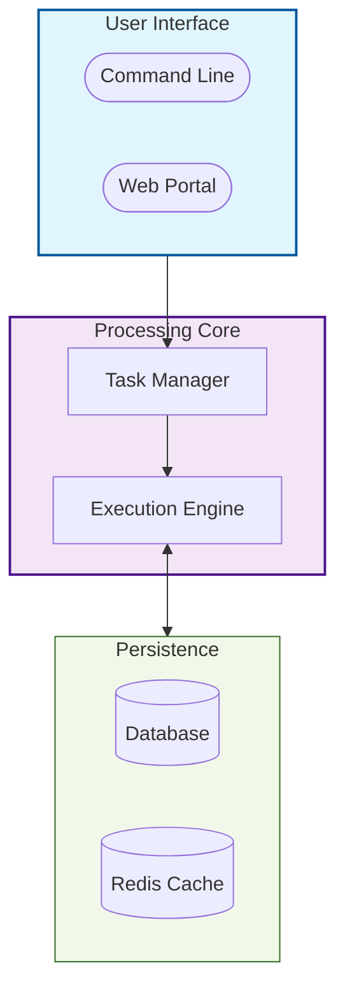
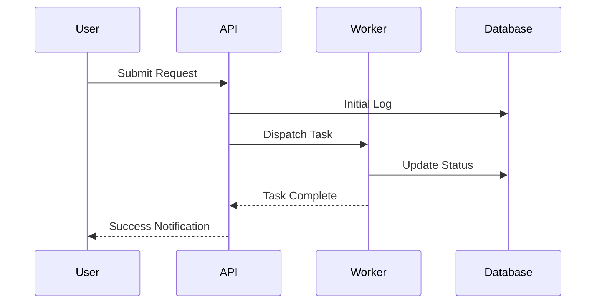
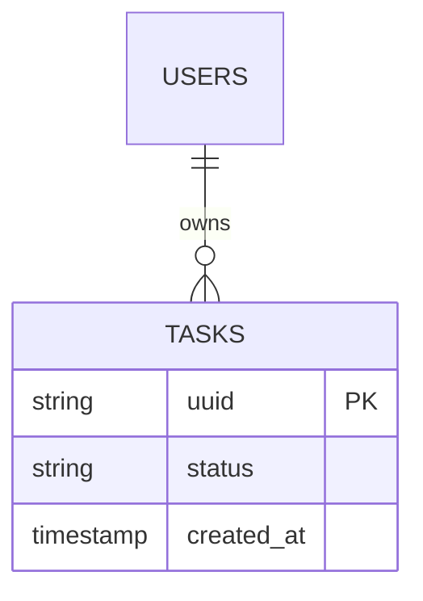

# [Project Name]

[One sentence value proposition - what does this project solve?]

---

## 📋 Table of Contents

- [Overview](#-overview)
- [System Architecture](#-system-architecture)
- [Getting Started](#-getting-started)
- [Core Functionality](#-core-functionality)
- [CLI Reference](#-cli-reference)

## Table of Contents 📋

- [\[Project Name\]](#project-name)
  - [📋 Table of Contents](#-table-of-contents)
  - [Table of Contents 📋](#table-of-contents-)
  - [Overview 🛡️](#overview-️)
    - [Key Features](#key-features)
  - [System Architecture 🏗️](#system-architecture-️)
    - [Data Flow](#data-flow)
  - [Getting Started 🚀](#getting-started-)
    - [Installation](#installation)
    - [Quick Start](#quick-start)
  - [Core Functionality ⚙️](#core-functionality-️)
    - [Execution Modes](#execution-modes)
  - [CLI Reference 🛠️](#cli-reference-️)
  - [Configuration 🔧](#configuration-)
  - [Database Schema 💾](#database-schema-)
  - [Version History 📅](#version-history-)
  - [License 📜](#license-)

---

## Overview 🛡️

[Detailed description of the program/service and its role in the ecosystem.]

### Key Features

- ✅ **Feature A**: Description of capability.
- ✅ **Feature B**: Description of capability.
- ✅ **Feature C**: Description of capability.

---

## System Architecture 🏗️

This section describes the logical flow and component interactions.



### Data Flow



---

## Getting Started 🚀

### Installation

```bash
# Clone the repository
git clone [repo-url]
cd [project-dir]

# Install dependencies
pip install -e .
```

### Quick Start

1. **Initialize**:

    ```bash
    [command] init
    ```

2. **Run**:

    ```bash
    [command] run
    ```

---

## Core Functionality ⚙️

[Deep dive into the main logic or mechanics of the project.]

### Execution Modes

| Mode         | Context    | Isolation     |
| :----------- | :--------- | :------------ |
| **Standard** | Default    | Process-level |
| **Isolated** | Production | Venv-level    |

---

## CLI Reference 🛠️

| Command | Arguments      | Description               |
| :------ | :------------- | :------------------------ |
| `run`   | `--batch-size` | Executes the main process |
| `stats` | `--json`       | Shows current status      |

---

## Configuration 🔧

The system is configured via `config.yaml`.

| Parameter     | Default | Description                   |
| :------------ | :------ | :---------------------------- |
| `max_workers` | 4       | Number of parallel threads    |
| `timeout`     | 60      | Connection timeout in seconds |

---

## Database Schema 💾



---

## Version History 📅

| Version   | Date       | Changes                                                      |
| :-------- | :--------- | :----------------------------------------------------------- |
| **4.0.0** | 2026-02-01 | App-specific Alembic, Docker testing pipeline, SchemaManager |
| **3.0.0** | 2026-01-07 | Multi-application support, DDD restructuring                 |
| **2.3.0** | 2025-12-15 | Initial Hotel implementation                                 |

---

## License 📜

This project is licensed under the **INTELAG Proprietary License**.
Unauthorized copying or distribution is strictly prohibited.

---

**Maintained by:** [INTELAG](https://github.com/INTELAG)
**Last Updated:** 2026-02-01
